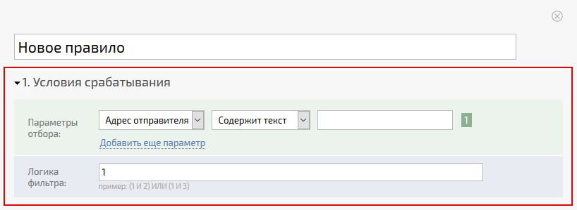
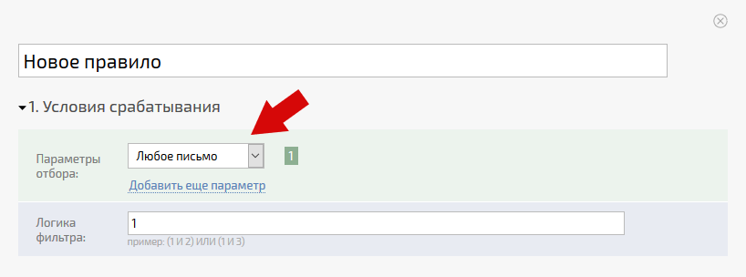

**Условия срабатывания** \- первый блок [ правила обработки почты](Правила_создания_задач_по_e-mail.md "Правила создания задач по e-mail"), который необходимо заполнить при [ его создании](Создание_и_редактирование_правил.md "Создание и редактирование правил"). Блок содержит условия, которым должно соответствовать письмо для срабатывания этого правила: 

  

При этом: 

  * Блок может содержать одно или несколько условий, соединенных логическими выражениями

  * Блок может не содержать ни одного условия, тогда правило будет срабатывать для всех писем, пришедших на адрес, на котором оно настроено. Но для большей наглядности мы рекомендуем в таких случаях использовать конструкцию **Любое письмо** :

    

  

Типы условий, используемых в блоке условий срабатывания: 

  * [Содержит текст](Содержит_текст.md "Содержит текст")

  * Не содержит текст

  * = (Равно)

  * [Содержит слово с меткой](Содержит_слово_с_меткой.md "Содержит слово с меткой") (устаревшее)
