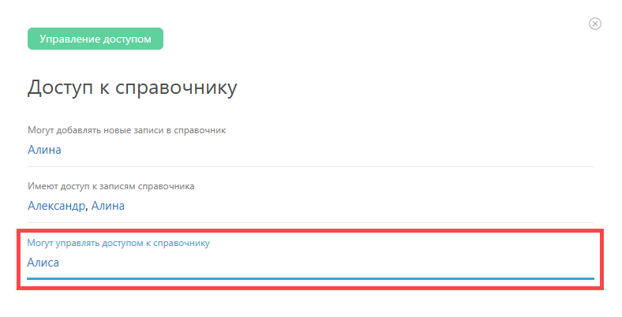

По умолчанию, права на настройку доступа к [ справочнику](Справочники.md "Справочники") есть у [ администраторов аккаунта](Роли_в_ПланФиксе.md "Роли в ПланФиксе"). Администратор аккаунта может предоставить право управлять доступом к справочнику другим сотрудникам. Для этого сотрудники добавляются в специальное поле **Могут управлять доступом к справочнику** на панели **Права доступа** в справочнике: 

  * Разрешить управлять доступом к справочнику можно только сотрудникам.

  * Пользователи, которым дали разрешение на управление правами доступа, видят все настройки в [ интерфейсе настройки прав доступа](Настройка_доступа_к_справочнику.md "Настройка доступа к справочнику") и могут ими управлять.

  * Пользователи, которым дали разрешение на управление правами доступа, могут настраивать права доступа к записям справочника, в том числе и себе самим.

  * Эти пользователи не видят блок **Могут управлять доступом к справочнику** и не могут управлять им.
