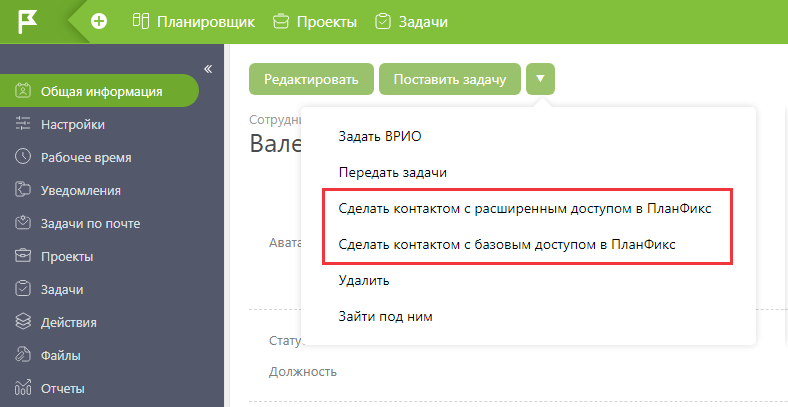

В [ карточке сотрудника](Страница_пользователя.md "Страница пользователя") вы можете преобразовать его в [ контакт](Контакты.md "Контакты"). Это может понадобиться, в частности, при [ увольнении сотрудника](Как_уволить_сотрудника.md "Как уволить сотрудника"), с которым вы сохраняете рабочие отношения. После преобразования, сотрудник по вашему выбору станет [ контактом с доступом в систему](Внешний_пользователь.md "Внешний пользователь"), либо обычным [ контактом](Контакты.md "Контакты") без доступа в ПланФикс: 

  

## Важно

  * При преобразовании в контакт будут утеряны данные о параметрах, специфичных для сотрудника и отсутствующих у контакта: руководителей сотрудника, принадлежность к группам и данные из дополнительных (кастомных) полей сотрудника.

  * Соответственно, при переводе сотрудника в контакт и потом обратно в сотрудники, эти данные не будут восстановлены.
