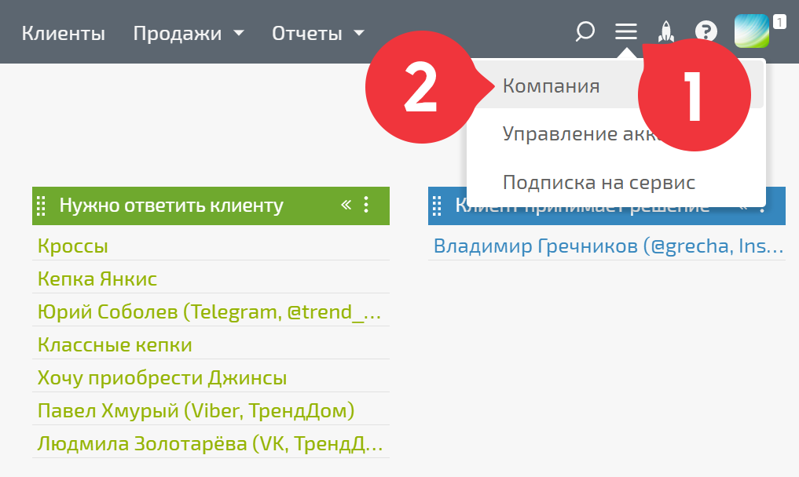
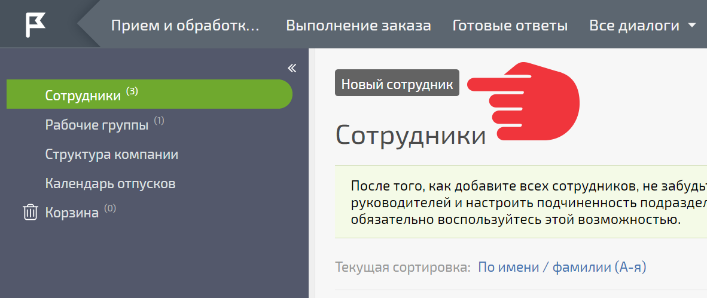
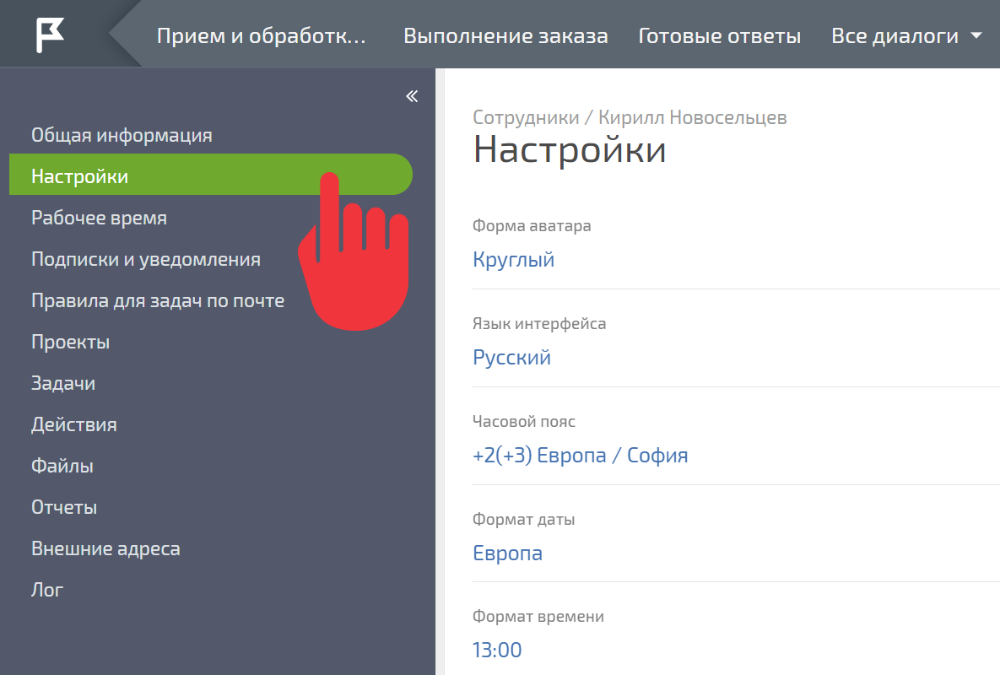
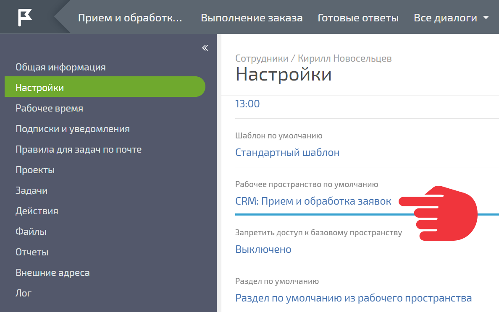

Для добавления сотрудника, который будет работать с заявками в конфигурации [CRM: Прием и обработка заявок](CRM__Прием_и_обработка_заявок.md "CRM: Прием и обработка заявок"): 

  * Перейдите в раздел **Компания** :

  

  * Добавьте нового сотрудника

  

  * Укажите имя, фамилию и адрес электронной почты сотрудника

  * Нажмите **Создать сотрудника**

  * В созданной карточке сотрудника перейдите на панель **Настройки** :

  

  * Установите **Рабочее пространство по умолчанию** CRM: Прием и обработка заявок:

  

Сотрудник получит приглашение с активационной ссылкой на указанный вами адрес. Перейдя по ссылке, он самостоятельно задаст логин и пароль для последующей работы в ПланФиксе. Войдя в систему, он сразу окажется в рабочем пространстве **CRM: Прием и обработка заявок** и сможет начать работу. 

  

## Важно

Чтобы добавленный сотрудник видел новые заявки, добавьте его в шаблон **Диалог с клиентом** , как это описано [ тут](Шаблоны_задач_и_контактов.md "Шаблоны задач и контактов").
