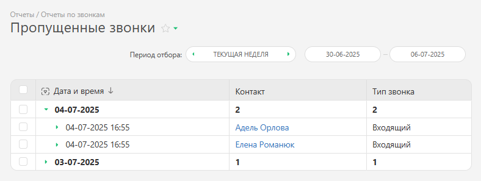

Этот отчет служит для получения данных о количестве и времени пропущенных звонков за определенный промежуток времени. Он доступен после подключения интеграции с одной из [виртуальных АТС](Виртуальные_АТС.md "Виртуальные АТС"). 

Для запуска отчета перейдите в раздел "Отчеты" — "Отчеты по звонкам" — "Отчет: Пропущенные звонки": 

