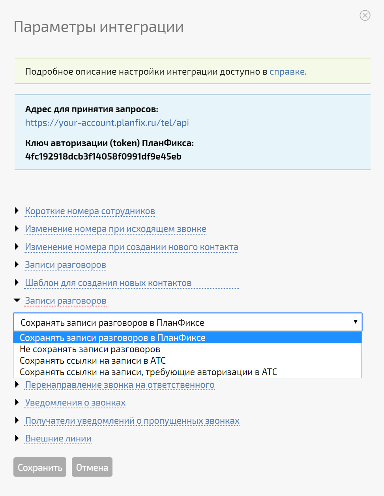
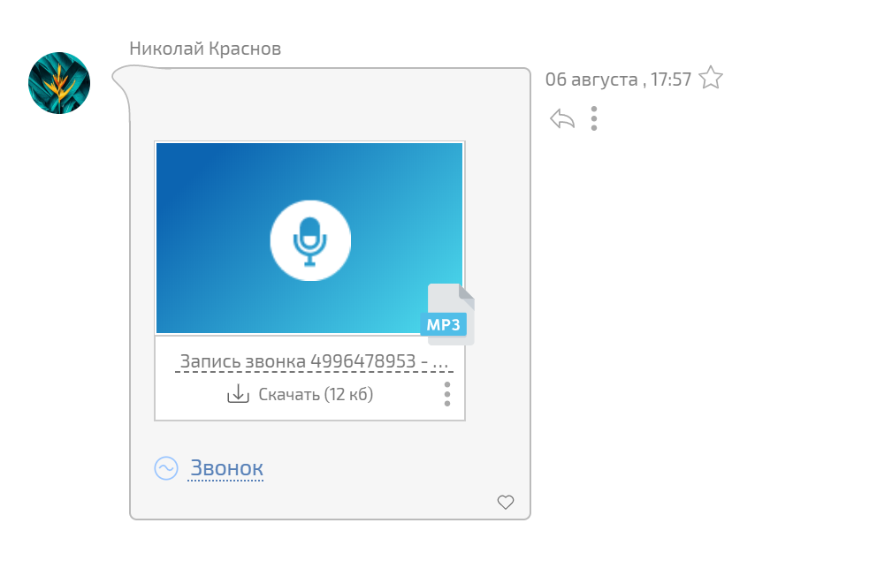

При подключении интеграции с [ ВАТС](Виртуальные_АТС.md "Виртуальные АТС") вы можете выбрать: загружать записи телефонных переговоров в ПланФикс или нет, используя следующую опцию: 

  

  

Варианты, доступные в этом списке, могут отличаться в зависимости от возможностей, предоставляемых конкретной виртуальной АТС. 

С точки зрения интерфейса, прослушивание звонков, хранящихся на стороне АТС, практически ничем не отличается от варианта с хранением их в ПланФиксе – в обоих случаях, запись разговора выглядит как файл, прикрепленный к [ действию](Действия.md "Действия") в [ карточке контакта](Карточка_контакта.md "Карточка контакта") или [ задачи](Карточка_задачи.md "Карточка задачи"), который можно прослушать или скачать: 

  

  

При этом внутренняя разница очень существенна: если файл не хранится в ПланФиксе, то при клике на него система запрашивает актуальную ссылку на файл у АТС и, если она может быть предоставлена, загружает файл с записью в окошко просмотра. 

  

## Важно!

При всех вариантах настроек запись должна осуществляться в облако на стороне АТС. ПланФикс технически не может делать запись сам, т.к. он только получает уведомления о состоянии звонка, но сам звонок через него не идет. Выбранные вами варианты настройки для записей влияют только на то, будет ли ПланФикс копировать записанные разговоры к себе или нет.
