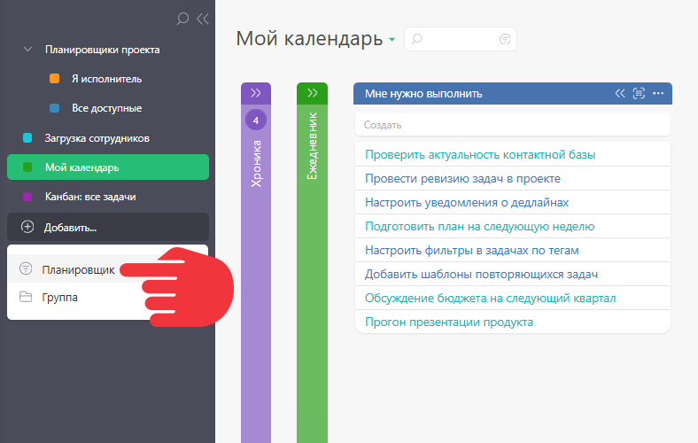
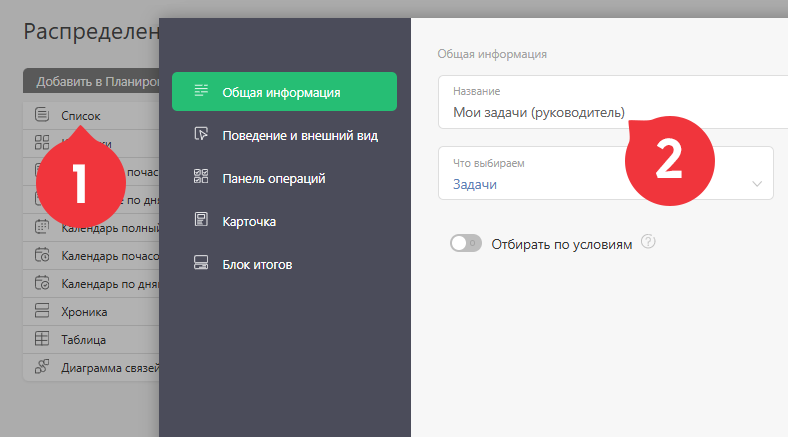

Простой список — это один из [видов списков Планировщика](Виды_списков_планировщика.md "Виды списков планировщика"), предназначенный для быстрой фиксации ни к чему не привязанных задач, заметок, идей или дел. 

## Навигация

  * Отличие простого списка от списка с условиями

  * Как создать простой список

  * Как работать с простыми списками

## Отличие простого списка от списка с условиями

Главное отличие от [обычных списков](Список_в_Планировщике.md "Список в Планировщике") планировщика — отсутствие отбора по условиям. Переключатель не активен: 

  

Обычные списки (включён отбор по условиям) — это инструмент для более осознанного управления задачами в ПланФиксе: 

## Как создать простой список

  * Создаём Планировщик для канбана:

  

  * Добавляем список:

  

  * Накидываем в список идеи или дела, которые надо выполнить:

## Как работать с простыми списками

Алгоритм работы такой: 

  * Добавили задачи в простой список.

  * Продумали: кто, когда и в какой последовательности этим займётся.

  * Отдали задачи в работу, перетащив их в [обычный список](Список_в_Планировщике.md "Список в Планировщике").

  

Задача примет указанные атрибуты того списка, в который её перетащили.
