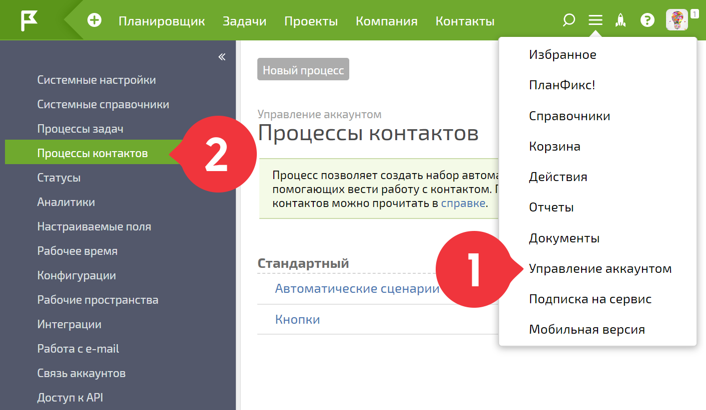
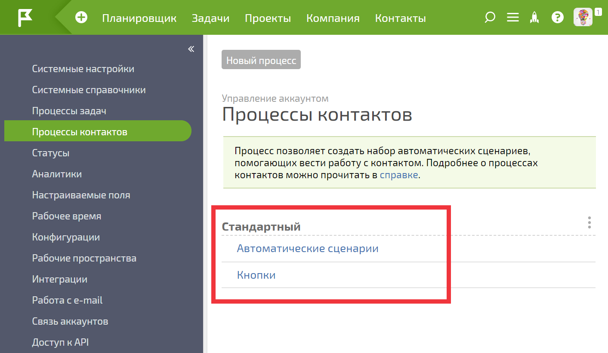
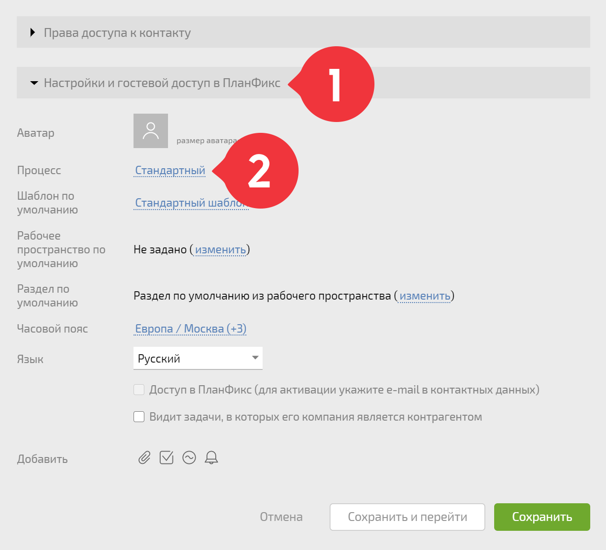

_Это справочная статья о**Процессах контактов**. Вы также можете ознакомиться с отдельной статьей о [ Процессах задач](Процессы.md "Процессы")._

**Процессы контактов** позволяют задать для каждого типа [ контактов](Контакты.md "Контакты") свой набор [ автоматических сценариев](Автоматические_сценарии_для_контактов.md "Автоматические сценарии для контактов") и кнопок, которые будут распространять на него свое действие. 

Создать новый или отредактировать существующий процесс контактов можно в меню **Управление аккаунтом / Процессы контактов:**

  

Процесс может включать в себя [Автоматические сценарии для контактов](Автоматические_сценарии_для_контактов.md "Автоматические сценарии для контактов") и [Кнопки](Кнопки.md "Кнопки"): 

  

В каждом [ шаблоне контакта](Шаблоны_контактов.md "Шаблоны контактов") выбирается тот или иной процесс: 

  

На созданные по такому шаблону контакты распространяется действие автоматических сценариев и кнопок, добавленных в этот процесс.
