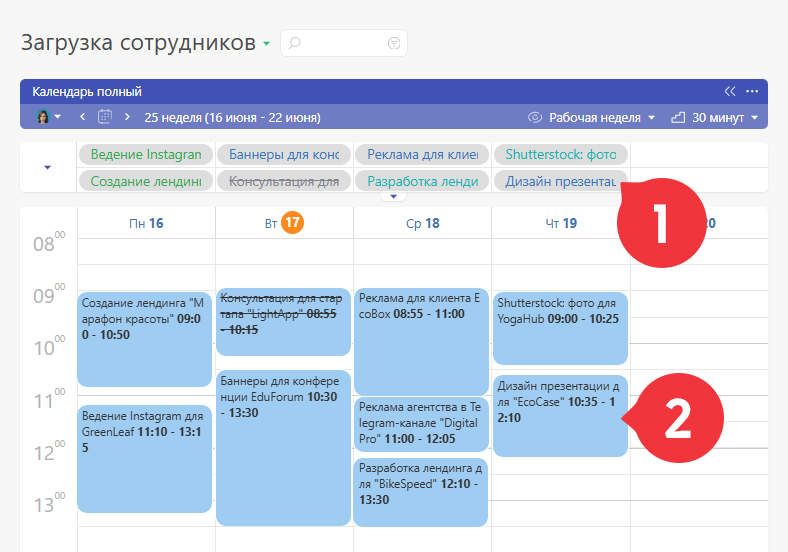
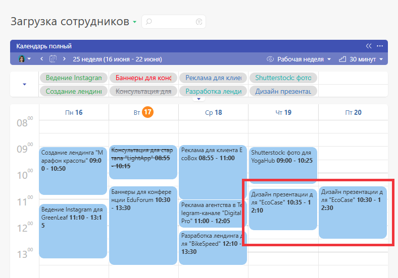
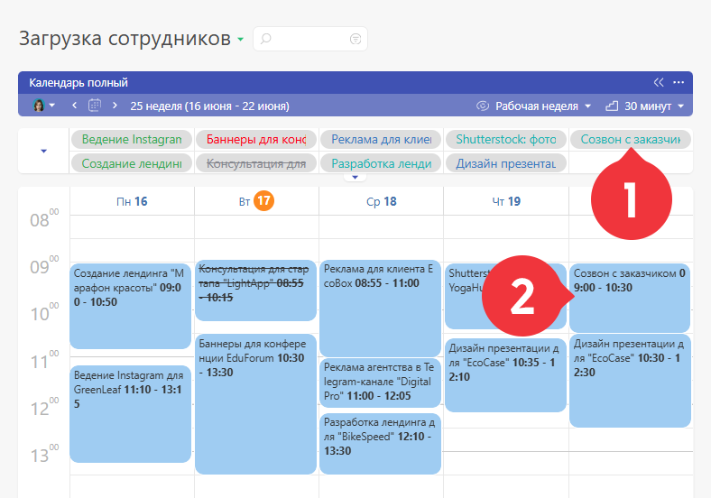

В [ почасовом блоке](Календарь_почасовой.md "Календарь почасовой") планировщика могут отображаться аналитики, содержащие реквизиты типа "Дата" и "Период времени" (в аналитике должны быть оба реквизита). Это позволяет достаточно гибко использовать почасовой блок для добавления аналитик нужного типа к задаче, и наоборот - для отображения задач в почасовом блоке. 

Рассмотрим примеры работы с почасовым блоком на примере стандартной аналитики [ Планируемое время работы](Управление_временем.md "Управление временем"). 

## Тянем задачу на почасовой блок

Если вытащить задачу из [ списка](Список__(Планировщик_.md) "Список \(Планировщик\)") или [ календаря по дням](Календарь_по_дням.md "Календарь по дням") на почасовой блок, то к ней добавится [аналитика](Аналитика.md "Аналитика") заданного в почасовом блоке типа. На почасовом блоке тут же отобразится блок задачи: 

  

Этот блок можно растягивать и перемещать, изменяя тем самым значения в реквизите "Период времени" соответствующей аналитики. В нашем примере это аналитика **Планируемое время работы** , поэтому размер блока как бы говорит о времени, на которое запланирована работа над задачей. 

Одну задачу можно вытягивать на почасовой блок несколько раз, каждый раз создавая тем самым новую запись с аналитикой и "занимая" место в почасовом блоке: 

## Создаем задачу кликом на почасовом блоке

Существует и обратный пример использования почасового блока: если на нем кликнуть мышкой и растянуть блок на нужное время, ПланФикс создаст задачу, к которой сразу прикрепится аналитика нужного типа: 

  

Это удобный способ быстрого создания задачи на определенное время, например, встречи, планерки или дела. 

## Важно

  * Если в почасовом блоке отображается сразу несколько аналитик, то к создаваемой задаче будет добавлена аналитика того типа, который находится первым в списке.
