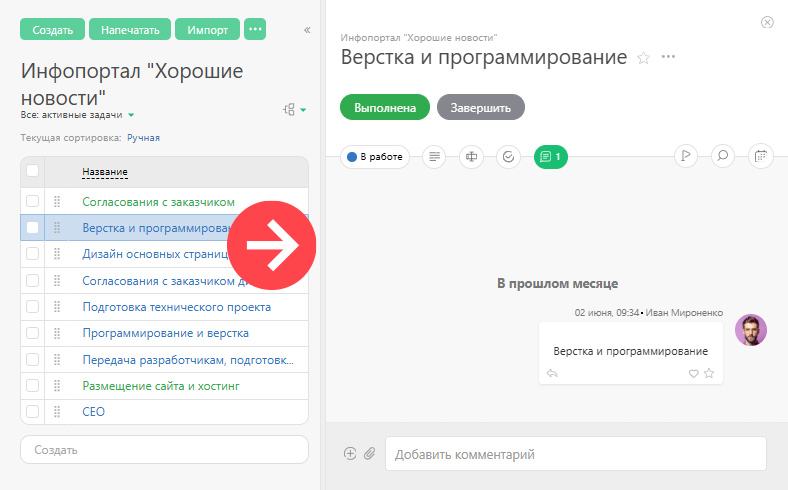

В большинстве разделов ПланФикса рабочая область занимает б**о** льшую часть экрана и находится рядом с [главным меню](Главное_меню.md "Главное меню") и [панелью инструментов](Панель_инструментов.md "Панель инструментов"). Здесь отображается основная информация объекта: 

Справа от рабочей области находятся переключатели [вкладок](Вкладки.md "Вкладки") (если в рабочей области отображен единичный объект ПланФикса, например Задача, как на этом скриншоте). Слева от рабочей области [фильтры](Фильтры.md "Фильтры") (если в рабочей области отображаются списки, например список задач).
