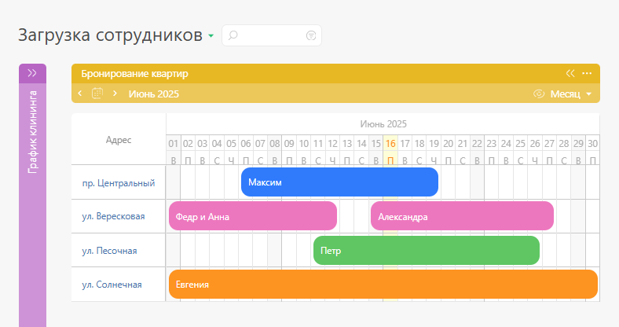
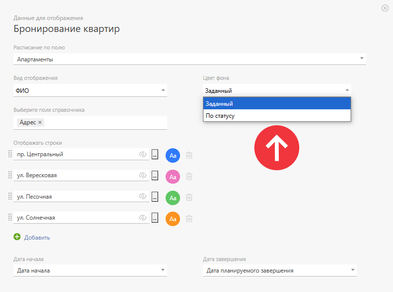
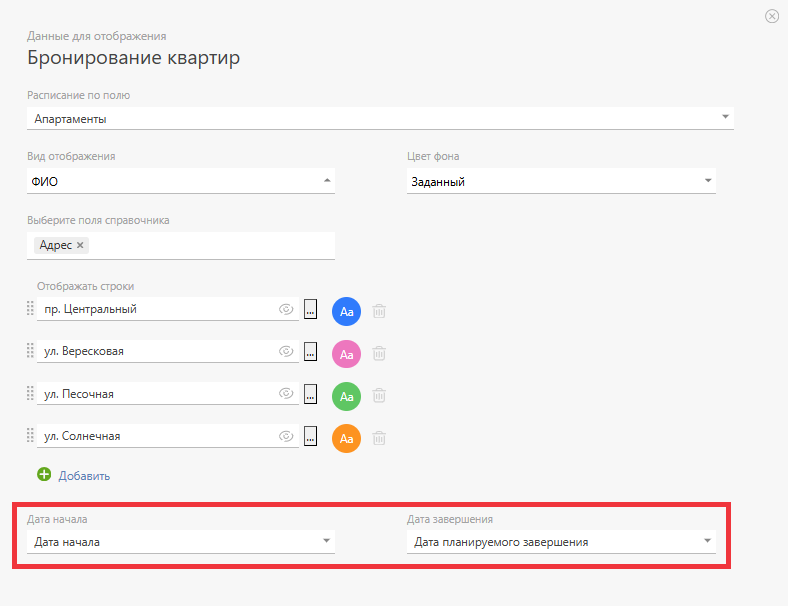

Этот тип списка [ Планировщика](Планировщик.md "Планировщик") позволяет управлять расписанием произвольных объектов. В левой части расписания находится перечень объектов, в правой — календарная сетка: 

  

Выделив желаемый диапазон дат напротив нужного объекта, можно создать задачу, которая отобразится в виде "блока занятости" на указанные даты. Таким образом можно в наглядном виде создавать задачи-бронирования для каждого объекта и тем самым строить календарь его загруженности. 

## Настройка расписания по дням

Блок настроек списка планировщика этого типа содержит несколько специфических параметров: 

  * **Расписание по полю** — позволяет выбрать поле, в котором хранятся объекты для расписания. Поддерживаются поля следующих типов: 

    * [Список](Список.md "Список")

    * [ Задача](Задача_-_Тип_поля.md "Задача - Тип поля")

    * [Запись справочника](Запись_справочника.md "Запись справочника")

    * [Набор значений справочника](Набор_значений_справочника.md "Набор значений справочника")

    * [Контакт](Контакт.md "Контакт")

    * [Сотрудник](Сотрудник.md "Сотрудник")

    * [ Контрагент](Контрагент_-_Тип_поля.md "Контрагент - Тип поля")

    * [Группа, сотрудник или контакт](Группа_сотрудник_или_контакт.md "Группа сотрудник или контакт")

    * [Список пользователей](Список_пользователей.md "Список пользователей")

    При использовании полей, содержащих записи справочника, есть возможность указать дополнительные поля справочника для вывода в таблице расписания:

  

  * **Цвет фона** — позволяет выбрать принцип, по которому будут окрашиваться блоки занятости (задачи) в расписании. Поддерживается 2 варианта:

    

  * По статусу задачи

  * Устанавливаемые вручную для каждого объекта (строки расписания)

  

  * **Отображать строки** — здесь необходимо добавить все объекты, по которым будет отображаться расписание.

  * **Дата начала** и **Дата завершения** — это поля типа "Дата", которые указывают, когда начинается и заканчивается блок занятости. Эти даты можно задать с помощью любых полей типа "Дата". Это расширяет рамки использования расписания и повышает удобство работы (см. пример с [бронированием квартир](https://planfix.com/ru/blog/raspisanie-po-dnyam/)).

## Важно

  * Внутри расписания блоки можно перемещать в том числе и между разными строками-объектами.

  * Во всем расписании корректно отображается до 150 задач.

  * Список Планировщика типа "Расписание по дням" может использоваться только в платных аккаунтах ПланФикса.

## Полезно

  * [Пример организации посуточного бронирования квартир](https://planfix.com/ru/blog/raspisanie-po-dnyam/)
