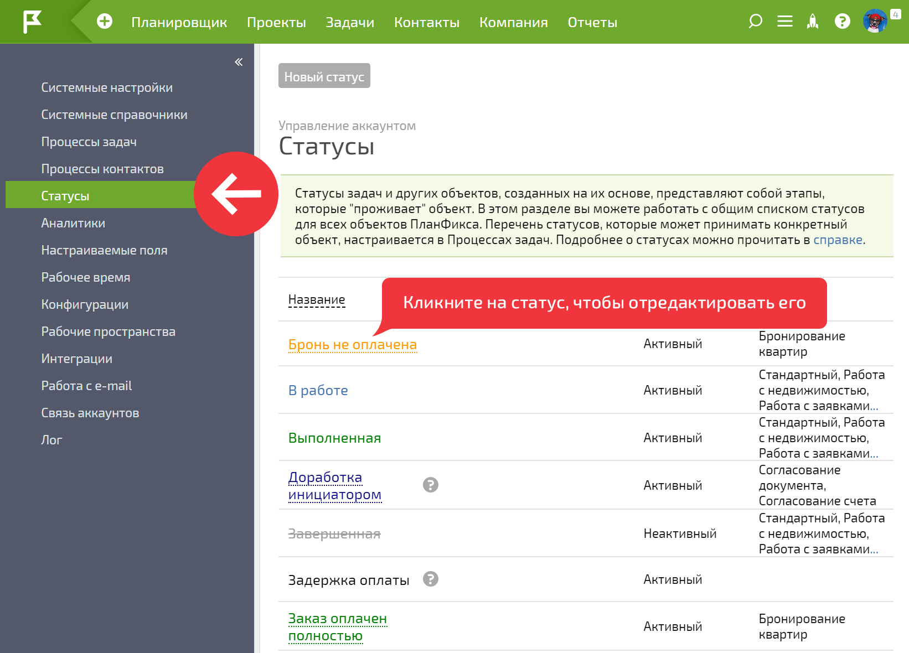
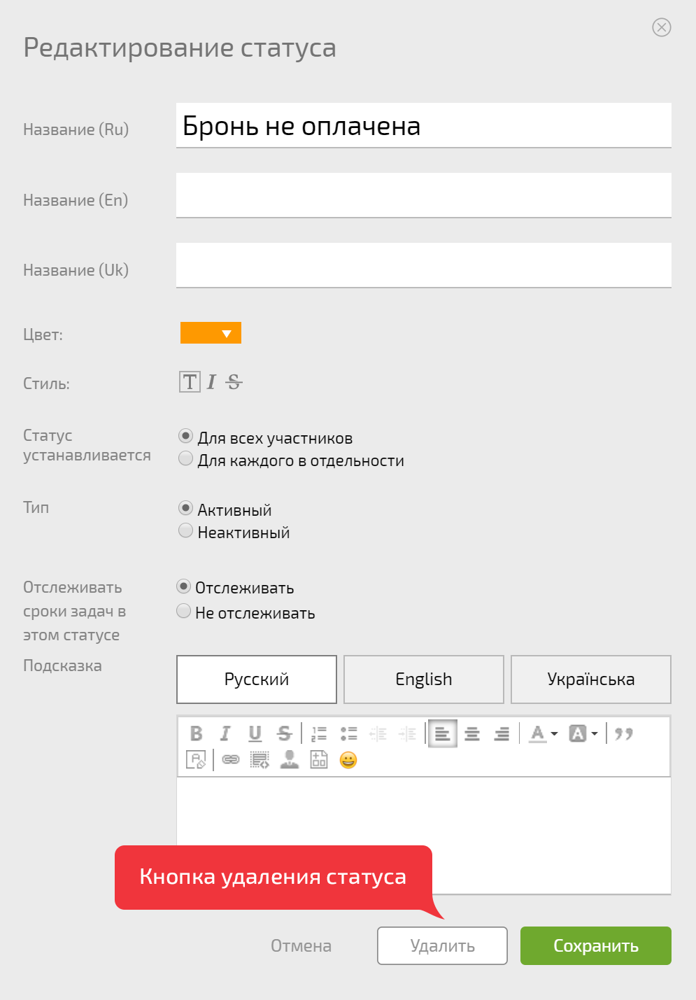

Вы можете удалить неиспользуемый [ статус задачи](Какой_смысл_в_статусах_задач_.md "Какой смысл в статусах задач?") из конкретного набора статусов или полностью удалить его из системы. 

  

## Удаление статуса из набора статусов

Если статус не используется в определенном [ процессе](Процессы.md "Процессы"), вы можете удалить его из набора статусов этого процесса, при этом сохранив этот статус в системе для дальнейшего использования. 

Удаление происходит в интерфейсе [ настройки набора статусов](Настройка_правил_перехода_между_статусами.md "Настройка правил перехода между статусами"). Из набора можно удалить как [ пользовательские статусы](Пользовательские_статусы_задачи.md "Пользовательские статусы задачи"), добавленные вами в систему, так и [ стандартные статусы ПланФикса](Какой_смысл_в_статусах_задач_.md "Какой смысл в статусах задач?"). 

  

## Удаление статуса из системы

Отредактировать или удалить пользовательский статус задачи можно во вкладке **Статусы** в меню **Управление аккаунтом**. Для редактирования просто кликните на нужном статусе: 

  

Откроется окно редактирования. В нем кроме опций редактирования, доступно также удаление статуса. 

  

**Важно** : 

  * При удалении таким образом произойдет **полное удаление** статуса из системы.

  * Описанным образом можно удалить только [ пользовательские статусы задач](Пользовательские_статусы_задачи.md "Пользовательские статусы задачи"), которые вы добавили в систему ранее.
