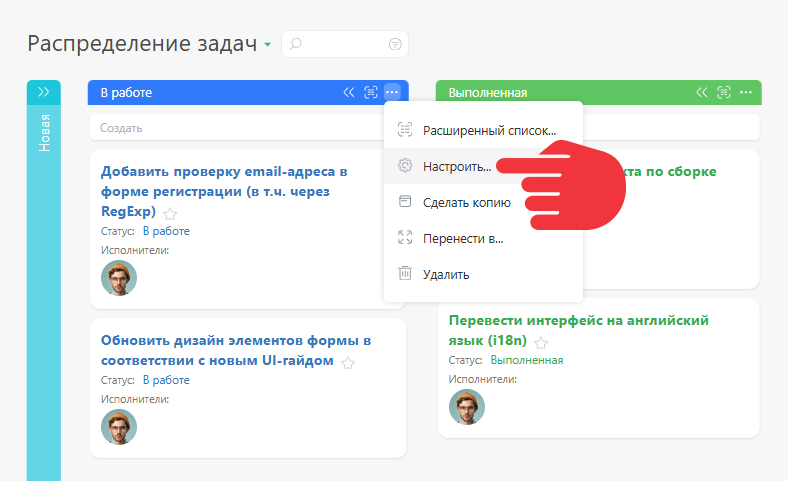
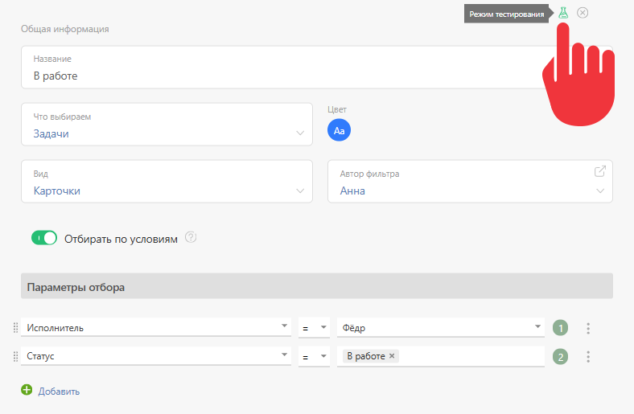
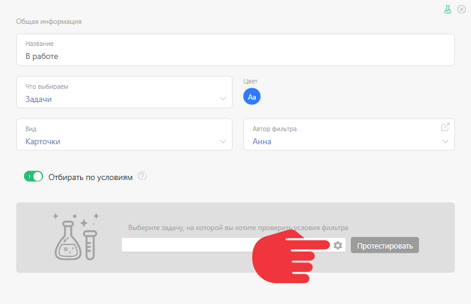
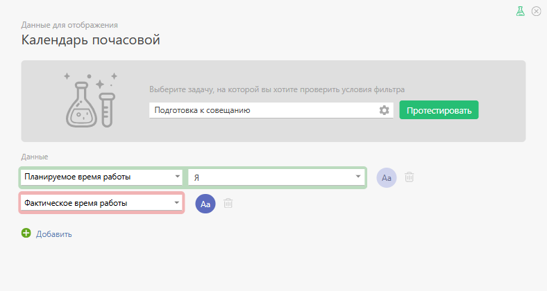

Режим тестирования списков [Планировщика](Планировщик.md "Планировщик") позволяет проверить, будет ли отображена в списке задача или контакт, а если не будет, то по какой причине. 

Для того, чтобы открыть режим тестирования, перейдите в окно редактирования нужного списка задач: 

  

Нажмите на пиктограмму с изображением колбы, чтобы активировать режим тестирования: 

  

Как и в случае с тестированием [ фильтров](Фильтры_задач.md "Фильтры задач") и [ сценариев](Автоматические_сценарии.md "Автоматические сценарии"), после [ активации режима тестирования](Режим_тестирования.md "Режим тестирования"), в окне настроек списка появляется возможность выбрать конкретный объект для тестирования: 

  

После выбора объекта и запуска тестирования, вокруг каждого условия появится зеленая либо красная рамка: 

  * Зеленый цвет рамки говорит о том, что данное условие для выбранного объекта выполняется.

  * Красный — не выполняется.

## Параметры отбора объекта в список

В блоке **Параметры отбора** режим тестирования работает так же, как [режим тестирования фильтров задач и контактов](Режим_тестирования_фильтров_задач_и_контактов.md "Режим тестирования фильтров задач и контактов"). 

## Тестирование данных аналитик

В списках типа [Календарь почасовой](Календарь_почасовой.md "Календарь почасовой") дополнительно тестируется наличие в выбранном объекте аналитики указанного типа для выбранного сотрудника. Пример ниже показывает, что в выбранной для тестирования задачи есть аналитика **Планируемое время работы** (зеленая рамка), но отсутствует аналитика **Фактическое время работы** (красная рамка) для выбранного сотрудника: 

## Как пользоваться режимом тестирования

  * Для тестирования параметров отбора объекта в список, используйте тот же порядок действий, что в [ режиме тестирования фильтров задач и контактов](Режим_тестирования_фильтров_задач_и_контактов.md "Режим тестирования фильтров задач и контактов").

  * Для списков типа [Календарь почасовой](Календарь_почасовой.md "Календарь почасовой") режим тестирования позволяет дополнительно убедиться в наличии у тестируемого объекта аналитик, отображаемых в почасовом календаре.
