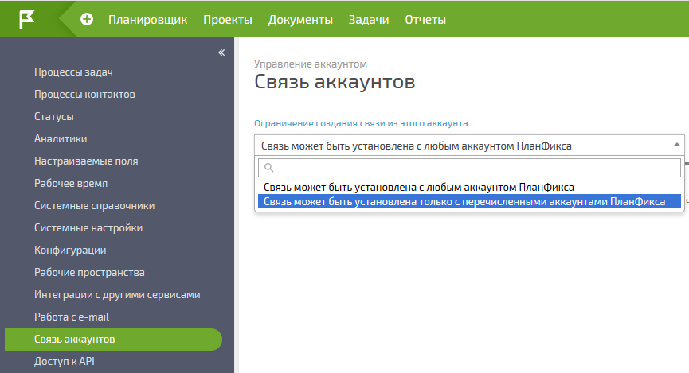
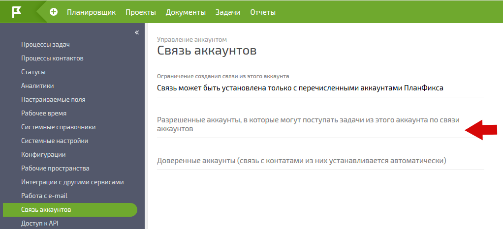
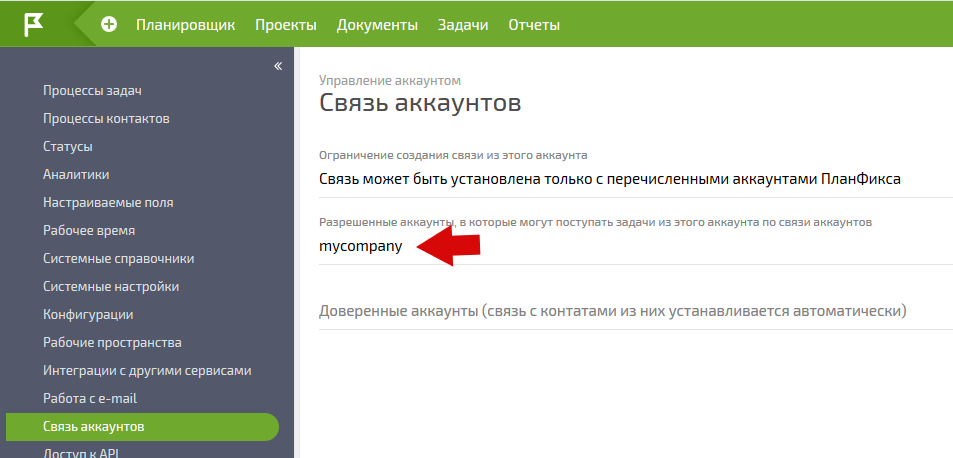
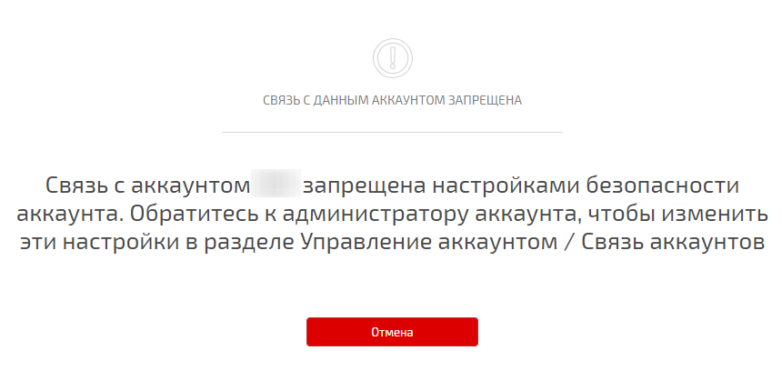

Администратор аккаунта может управлять настройками работы [ связи между аккаунтами](Связь_аккаунтов.md "Связь аккаунтов"): устанавливать ограничения на связь аккаунтов и регулировать список доверенных аккаунтов, связь с контактами из которых устанавливается автоматически. 

## Ограничение создания связей

По умолчанию, пользователи могут устанавливать исходящие связи из аккаунта в любой другой аккаунт. Например, сотрудник может установить связь своей учетной записи в текущем аккаунте с другим аккаунтом, который он считает для себя основным и в котором планирует работать. Это приведет к тому, что информация, доступная сотруднику в текущем аккаунте (в частности, тексты задач и комментариев, к которым он имеет доступ), будет автоматически транслироваться в его основной аккаунт. 

Аналогичным образом работает установка связи для контакта: достаточно создать контакт и указать ему в качестве адреса электронной почты [ внутренний email](Как_поставить_задачу_по_e-mail.md "Как поставить задачу по e-mail") из другого аккаунта, чтобы установилась связь и контакт смог обрабатывать адресованные ему в вашем аккаунте задачи и комментарии в своем основном аккаунте. 

Администратор может ограничить создание исходящих связей для сотрудников и контактов. Для этого в разделе **Управление аккаунтом / Связь аккаунтов** необходимо выбрать режим **Связь может быть установлена только с перечисленными аккаунтами ПланФикса** : 

  

При этом появится поле для ввода списка аккаунтов, с которыми разрешается связь. По умолчанию поле не содержит значений, что равносильно запрету на установку исходящих связей с другими аккаунтами: 

  

Для того, чтобы разрешить установку связей с определенным аккаунтом, необходимо добавить его название в этом поле: 

  

При попытке установить связь с аккаунтом, отсутствующим в этом списке, пользователь получит сообщение с информацией о запрете этого действия: 

  

## Доверенные аккаунты

Список доверенных аккаунтов служит для автоматического создания входящих связей с контактами из определенных аккаунтов: 

  

По умолчанию этот список пуст. Это означает, что автоматические связи из других аккаунтов в этот аккаунт устанавливаться не будут. То есть, если письмо, отправленное из ПланФикса на обычный email, будет переадресовано на [ внутренний email](Как_поставить_задачу_по_e-mail.md "Как поставить задачу по e-mail") этого аккаунта, то работа с этой задачей будет идти через почту, а не по связи аккаунтов. 

В случаях, когда работа идет в тесно связанных между собой аккаунтах - например, несколько аккаунтов холдинга или аккаунты клиента и подрядчика - можно добавить такие аккаунты в список доверенных. Для доверенных аккаунтов в описанной выше ситуации с пересылкой письма на внутренний адрес ПланФикса происходит автоматическая установка связи и дальнейшая работа идет напрямую, по связи аккаунтов, минуя отправку задач и действий электронной почтой. 

Для того, чтобы обеспечить удобное взаимодействие пользователей двух аккаунтов между собой, в каждом из этих аккаунтов нужно добавить в список доверенных название аккаунта, с которым происходит взаимодействие.
