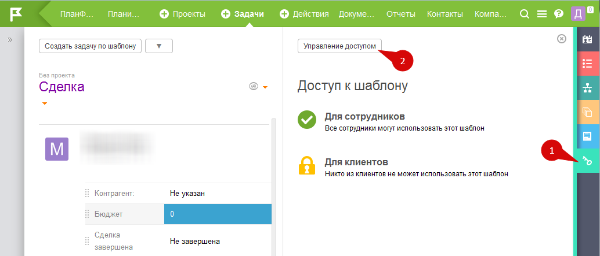

По умолчанию, конфигурация [Управление сделками](Управление_сделками.md "Управление сделками") не имеет разделения по ролям - вносить данные по сделкам имеют возможность любые сотрудники. При этом каждый сотрудник будет видеть данные только по сделкам, которые ввел сам или к которым имеет [ доступ](Права_доступа_в_ПланФиксе.md "Права доступа в ПланФиксе"). 

  

Если есть необходимость ограничить доступ к возможности создавать сделки и управлять ими, то сделать это можно следующим образом: 

  * **Ограничить доступ к шаблонам задач "Сделка" и "Активность по сделке"**. Для этого необходимо перейти в Главное меню / Задачи / Шаблоны, зайти в нужный шаблон и изменить доступ к нему:

  

  

  * **Ограничить доступ к планировщику "Управление сделками"** :

  

