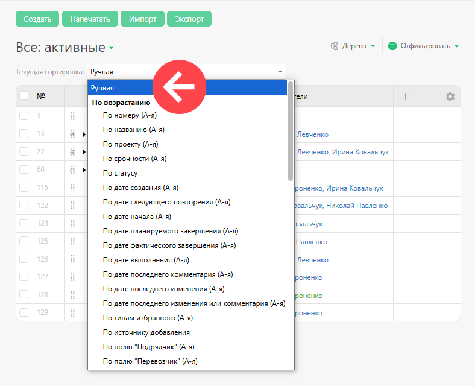
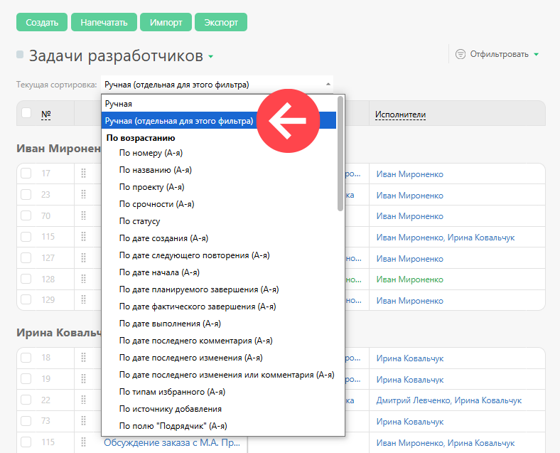
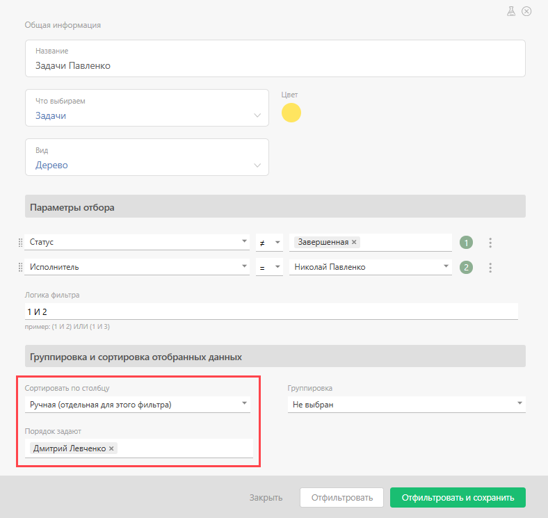
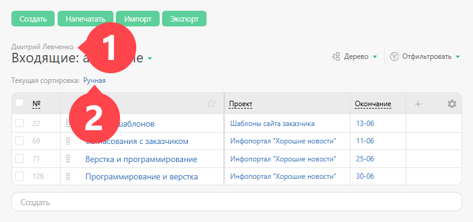

**Ручная сортировка задач** представляет собой способ наиболее гибкой и тонкой настройки приоритетов. 

Ручная сортировка задач доступна в трех вариантах: 

  * Ручная сортировка для всего аккаунта

  * Ручная сортировка сортировка в рамках выбранного [ фильтра задач](Фильтры_задач.md "Фильтры задач") или [ Планировщика](Планировщик.md "Планировщик")

  * Ручная сортировка задач конкретного сотрудника

## Ручная сортировка

Это сквозная сортировка задач по всему аккаунту. Ее можно использовать в любом фильтре задач или списке Планировщика: 

  

Если вы перетащите Задачу 2 выше Задачи 1 в фильтре, где включен этот вариант сортировки, то во всех других фильтрах, где присутствуют обе эти задачи, Задача 2 будет выше Задачи 1. 

При этом: 

  * Для того, чтобы иметь возможность перетащить одну задачу выше другой, у вас должен быть [ доступ на редактирование](Таблица_прав_доступа_к_задаче_по_ролям.md "Таблица прав доступа к задаче по ролям") обеих этих задач.

  * Если задачи в списке имеют общую надзадачу, то изменять их порядок может только тот, кто имеет права на редактирование этой надзадачи.

## Ручная сортировка (отдельная для этого фильтра)

Этот вариант сортировки задач работает только на уровне конкретного [ фильтра задач](Фильтры_задач.md "Фильтры задач") и не влияет на глобальную сортировку или сортировку в других фильтрах. Вы можете создать отдельный фильтр в разделе [Задачи](Задачи.md "Задачи") или в [ Планировщике](Планировщик.md "Планировщик"), отобрать туда задачи по нужному условию и задать ручную сортировку, которая будет действовать только в рамках этого фильтра: 

  

Изменять порядок задач в таком фильтре могут пользователи, которых вы укажете в настройках этого фильтра: 

  

Использование этого варианта наиболее предпочтительно, т.к. это позволяет размещать задачи в разном порядке в зависимости от текущего контекста. 

## Ручная сортировка задач конкретного сотрудника

Этот вариант доступен в списке задач в [ карточке сотрудника](Страница_пользователя.md "Страница пользователя"): 

  

По сравнению с первыми двумя вариантами, он имеет узкое применение и позволяет [ руководителю](Роли_в_ПланФиксе.md "Роли в ПланФиксе") установить в карточке сотрудника порядок выполнения им задач таким образом, чтобы сотрудник видел аналогичный порядок в своем разделе “Все / Входящие”.
