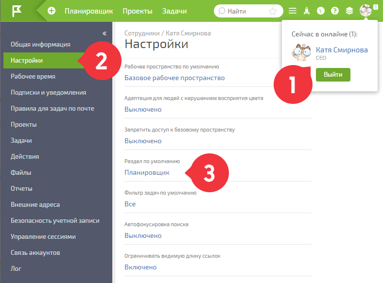
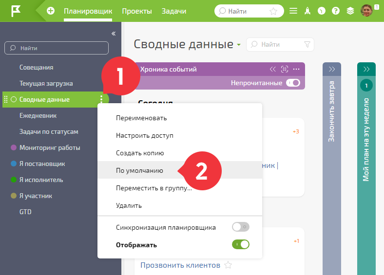

[Конфигурация](https://planfix.com/ru/ready-made-solutions/svodnye-dannye-p160/) — содержит стандартный планировщик **Сводные данные** , который позволяет организовать удобную работу с задачами и событиями. 

Установка доступна на любом тарифе. 

## Видеоинструкция

. 

[Смотреть видео на YouTube](https://youtu.be/sThWXoX-WtM)

## Ссылка для установки конфигурации

  * [Конфигурация в маркетплейсе](https://planfix.com/ru/ready-made-solutions/svodnye-dannye-p160/)

  * [Состав конфигурации](https://planfix.com/ru/ready-made-solutions/svodnye-dannye-p160/#package)

## Установка конфигурации

[ Установить конфигурацию](Инструкция_по_установке_конфигурации.md "Инструкция по установке конфигурации") может администратор аккаунта. После этого планировщик «Сводные данные» станет доступным всем пользователям аккаунта. Для того, чтобы этот планировщик стал стартовым экраном при входе в ПланФикс, необходимо: 

1\. Установить раздел [Планировщик](Планировщик.md "Планировщик") разделом по умолчанию в карточке пользователя: 

  

2\. Установить планировщик **Сводные данные** планировщиком по умолчанию: 

  

## Дополнительно

Видеоурок по работе с Хроникой в планировщике:
