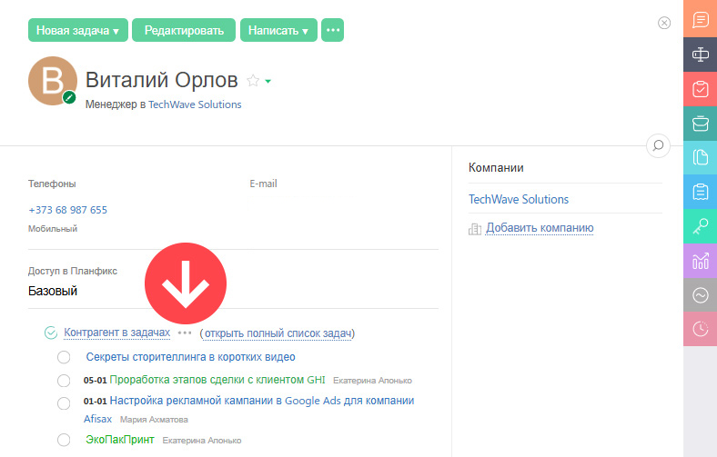
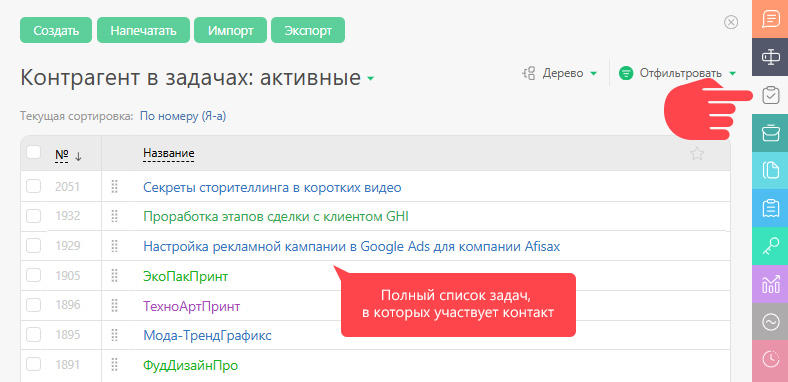

Любой контакт может выступать в [ задаче](Задачи.md "Задачи") в одной из двух ролей: 

  * **Контрагент** — это лицо или компания, являющиеся объектом данной задачи (заказчиком, подрядчиком и т.п.)

  * **Участник** — это контакт, имеющий одну из ролей в задаче (исполнитель, участник, постановщик, аудитор и т.п.)

В карточке контакта есть два признака, которые регулируют возможность для него выступать в той или иной роли: 

  * Отображать в списке выбора участников задачи

  * Отображать в списке выбора контрагента задачи

Настраивается в шаблоне контакта в разделе "Права доступа к контакту" — активация признаков влияет на отображение контакта в списках контрагентов и участников задачи. 

## Отображение задач в карточке контакта

На основном экране карточки контакта отображаются связанные с ним задачи: 

  

Если задач много, то на основном экране отображается только их часть. Полный список задач отображается на дополнительной панели "Задачи" в карточке контакта: 

  

Здесь же можно переключиться между стандартными фильтрами задач контакта и увидеть перечень задач, в которых он выступает в качестве другой роли. Для этого нажмите на заголовок списка задач и из выпадающего меню выберите нужную роль контакта.
