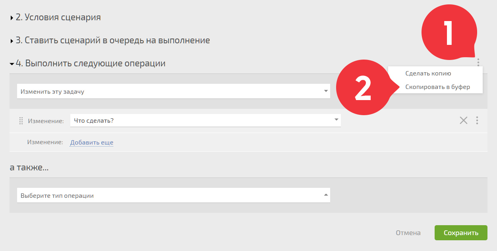
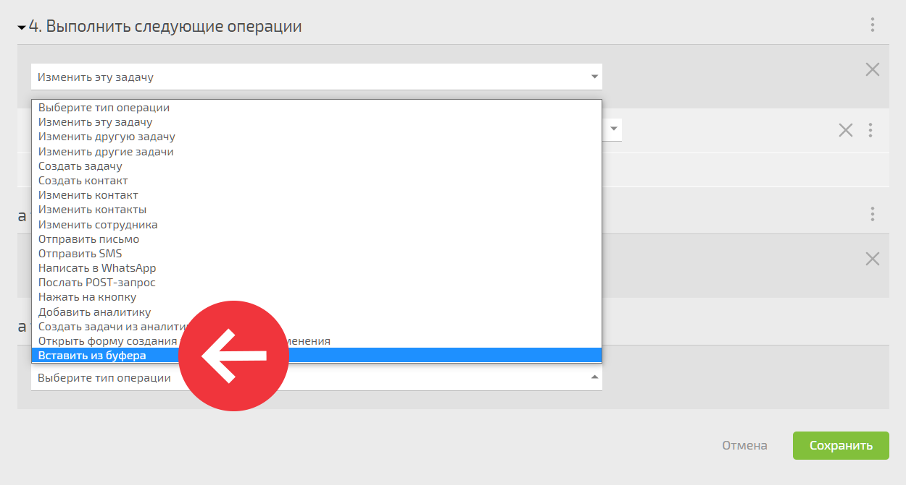

Операции [автоматического сценария](Автоматические_сценарии.md "Автоматические сценарии") можно копировать для использования в другом сценарии. Для этого в меню блока, который необходимо копировать, выберите пункт «Скопировать в буфер»: 

  

Данные из выбранного блока сохранятся в специальном буфере. Чтобы вставить их в нужный сценарий, выберите в списке операцию «Вставить из буфера»: 

  

## Важно

  * Данные буфера хранятся не на вашем устройстве, а на сервере ПланФикса.

  * Данные в буфере хранятся 24 часа, затем удаляются.
