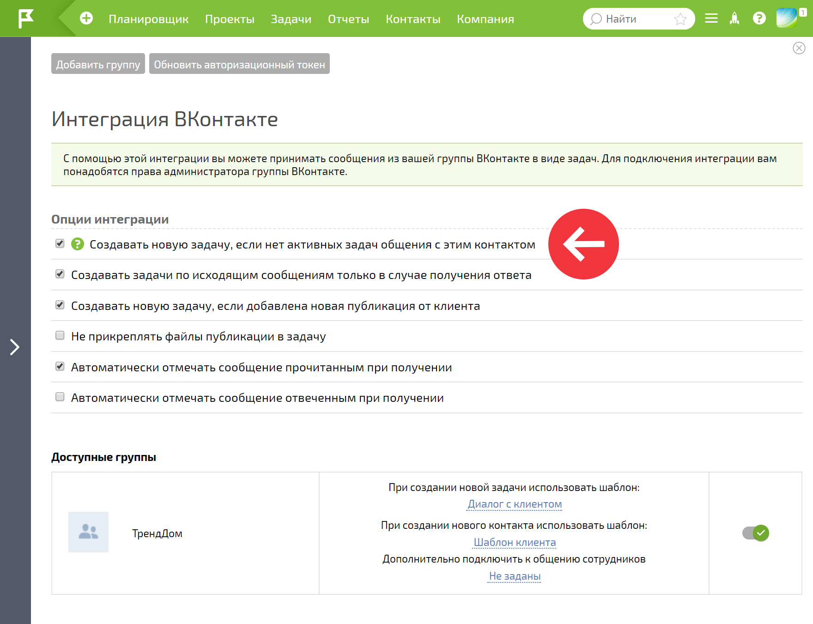

При настройке [ интеграций с мессенджерами и соцсетями](Интеграции.md "Интеграции") есть возможность создавать новую задачу, если нет [ активных](Тип_статуса_задачи.md "Тип статуса задачи") (то есть в любом активном статусе) задач по обращениям от клиента: 

  

По умолчанию чекбокс включен. При активном чекбоксе новая задача будет создаваться, если предыдущая задача данного клиента удалена, завершена или находится в неактивном статусе. При этом история переписки автоматически добавляется в описание созданной задачи: 

  

При неактивном чекбоксе все сообщения клиента будут попадать в одну задачу, независимо от ее текущего статуса. При этом если задача будет окончательно удалена из Корзины, при поступлении следующего сообщения от этого пользователя будет создана новая задача.
