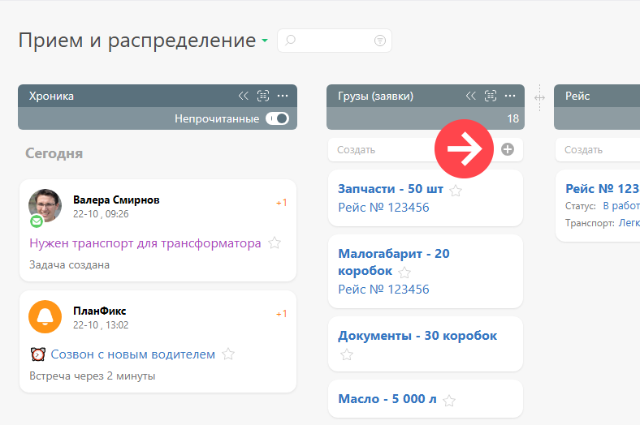

В [ фильтрах](Фильтры_задач.md "Фильтры задач") и [ списках планировщика](Виды_списков_планировщика.md "Виды списков планировщика") есть специальные области, при помощи которых можно [ быстро создать задачу](Быстрое_создание_задачи_в_списке.md "Быстрое создание задачи в списке"). По наведению курсора мыши на такое поле появляется пиктограмма со знаком плюс, которая служит для расширенного создания объекта ([задачи](Задачи.md "Задачи") или [ контакта](Контакты.md "Контакты")) в этом поле: 

  

Нажатие на плюс вызывает стандартное окно создание объекта, отображаемого в этом списке (далее для простоты используется термин "задача", но это же касается и контакта). При этом поля задачи автоматически заполняются параметрами, соответствующими [ параметрам отбора](Параметры_отбора_объектов.md "Параметры отбора объектов") в этот список. Это необходимо для того, чтобы задача сразу после создания появилась в этом списке. 

При этом применяется следующая логика: 

  * Все параметры отбора, перечисленные в условиях отбора, применяются к созданной задаче или контакту последовательно,в порядке, в котором они указаны в фильтре.

  * Если в списке условий есть несколько типовых - например, Статус 1 ИЛИ Статус 2 - то применится только одно, последнее условие (Статус 2 в данном примере). Такая логика используется для того, чтобы при настройке была возможность в явном виде указывать, какое условие должно примениться - для этого достаточно разместить его последним.

## Важно

  * Параметры, которая система автоматически подставит в окне создания задачи или контакта, могут быть изменены пользователем. В случае, если изменение не будет соответствовать параметрам отбора в список, созданный объект в него не попадет.
