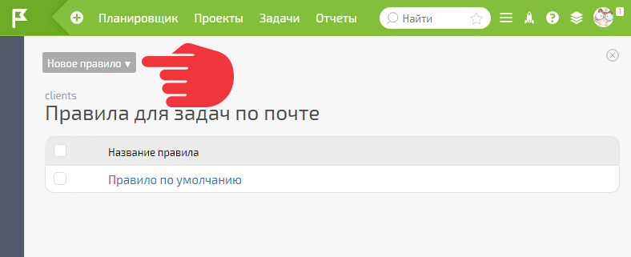
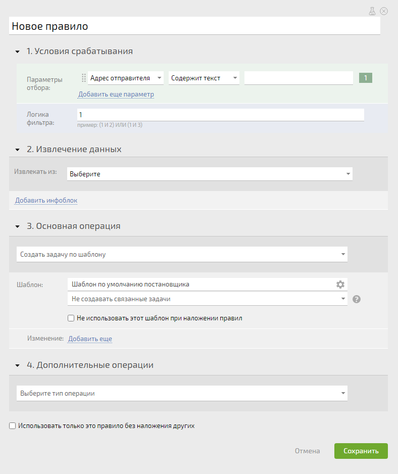
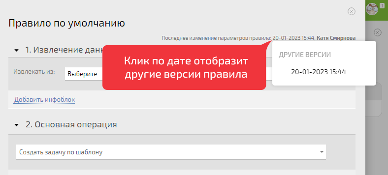

Создание [ правила обработки email](Правила_создания_задач_по_e-mail.md "Правила создания задач по e-mail") вызывается кнопкой **Новое правило** на панели инструментов внутри [ виртуального email-адреса](Виртуальные_e-mail_адреса.md "Виртуальные e-mail адреса") (а также [ адреса проекта](E-mail_адрес_проекта.md "E-mail адрес проекта") и [ внутреннего адреса сотрудника](Как_поставить_задачу_по_e-mail.md "Как поставить задачу по e-mail")): 

  

Окно создания правила выглядит следующим образом: 

  

## Общий алгоритм работы правила

При поступлении письма на адрес, для которого настроено правило, происходит следующее: 

  * Проверяется, соответствует ли письмо всем указанным в правиле условиям срабатывания.

  * Если да, то из письма извлекаются данные для занесения в ПланФикс.

  * Выполняется основное действие - создается задача, контакт или добавляется комментарий в существующую задачу.

  * Выполняются дополнительные действия, указанные в правиле. Созданный объект заполняется данными из письма.

  

## Окно правила обработки почты

Для удобства настройки, окно правила разбито на 4 блока, соответствующих описанным выше стадиям обработки: 

  * [ 1.Условия срабатывания](Правило_для_почты__Условия_срабатывания.md "Правило для почты: Условия срабатывания")

  * [ 2.Извлечение данных](Правило_для_почты__Извлечение_данных.md "Правило для почты: Извлечение данных")

  * [ 3.Основная операция](Правило_для_почты__Основная_операция.md "Правило для почты: Основная операция")

  * [ 4.Дополнительные операции](Правило_для_почты__Дополнительные_операции.md "Правило для почты: Дополнительные операции")

  

## Логирование версий правил

При изменении правил обработки почты предыдущие версии сохраняются. Для того, чтобы увидеть другие версии, кликните по дате последнего изменения параметров правила: 

  

## Важно

  * Если письмо соответствует условиям сразу нескольких правил, при его обработке эти правила будут [ накладываться по определенному алгоритму](Наложение_правил_обработки_писем.md "Наложение правил обработки писем").

  * Данный интерфейс создания и редактирования правил обработки почты начал функционировать в ноябре 2019 года. Он позволяет использовать для работы правил весь функционал операций, доступный в [ автоматических сценариях](Автоматические_сценарии.md "Автоматические сценарии"). До этого момента действовал [ старый вариант](Создание_и_редактирование_правил__(вариант_до_2019_года_.md) "Создание и редактирование правил \(вариант до 2019 года\)"), работа которого поддерживается для обратной совместимости. Со временем доступность старого варианта для новых аккаунтов может быть ограничена.

  

## Полезные ссылки

  * [Правила обработки почты 2019 — Новая итерация](https://planfix.com/ru/blog/pravila-obrabotki-pochty-2019-novaya-iteraciya/) (есть пример правила для разбора письма-заказа с сайта)

  * [Правила обработки почты 2019](https://planfix.com/ru/blog/pravila-obrabotki-pochty-2019/)

  * [Правила для почты: Набор действий](https://planfix.com/ru/blog/pravila-dlya-pochty-nabor-dejstvij/)

  * [Автоматическое создание правил для разбора почты](Автоматическое_создание_правил_для_разбора_почты.md "Автоматическое создание правил для разбора почты")
