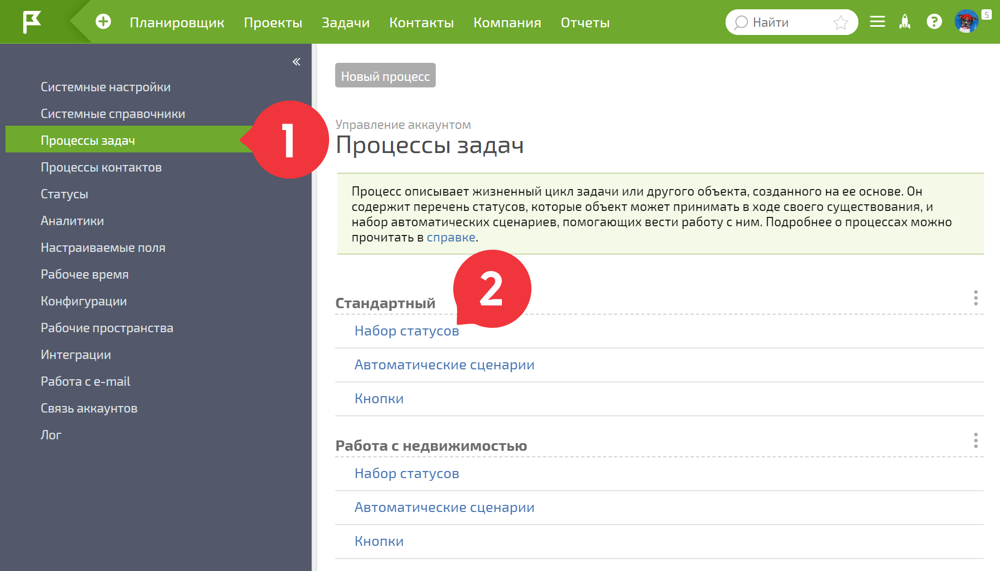
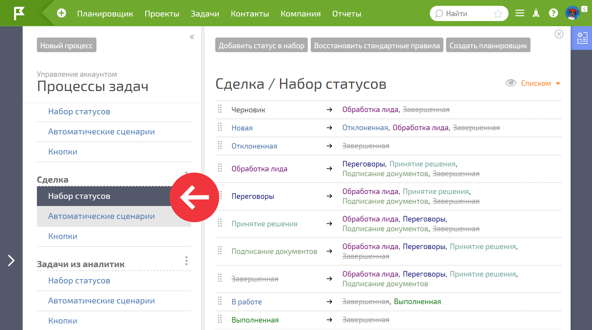
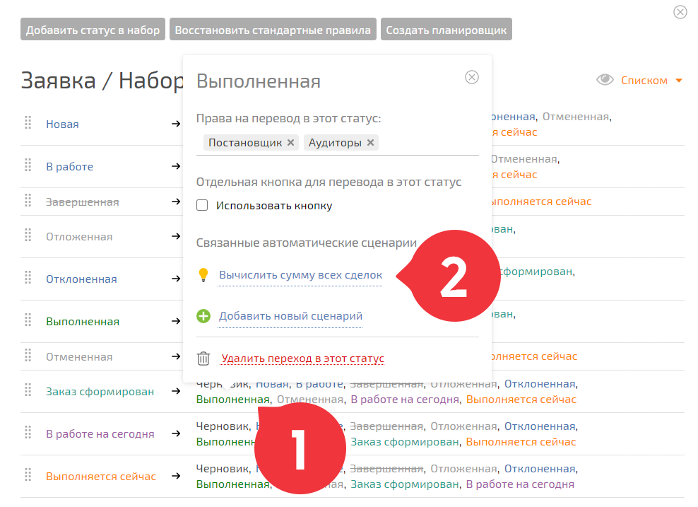
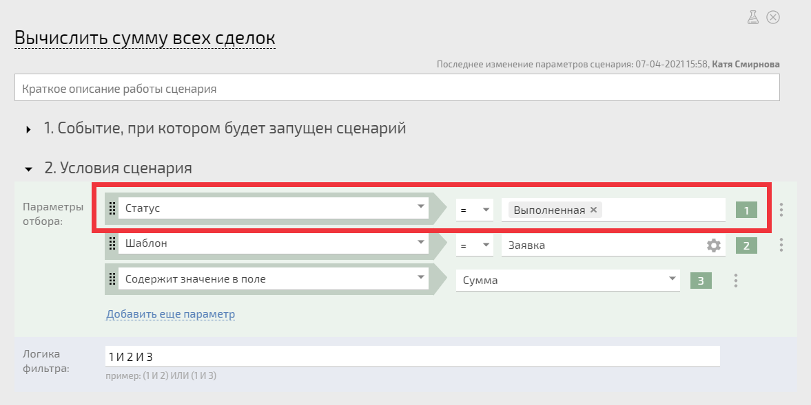

## ВАЖНО

**Данная справочная статья является устаревшей. В настоящее время процессы настраиваются в рамках Объекта. Мы рекомендуем использовать[справочную информацию по Объектам](Объекты.md "Объекты") для настройки бизнес-процессов в вашем аккаунте.**

Информация ниже сохранена исключительно в целях поддержания обратной совместимости процессов, настроенных ранее в старых аккаунтах ПланФикса. 

  

\- 

  

**Набор статусов** это одна из важных составляющих [ процесса задач](Процессы.md "Процессы"). Он определяет, какие статусы может принимать задача или созданный на ее основе объект в ходе своего жизненного цикла, а также правила перехода между статусами и сопутствующие этому дополнительные параметры. Набор статусов можно создать или отредактировать в соответствующей вкладке процесса: 

  

По клику на название набора открывается интерфейс его редактирования: 

  

в котором можно добавить, отредактировать или удалить статусы, а также настроить правила переходов между ними. 

  

## Настройка набора статусов

  * [Добавление нового статуса](Добавление_нового_статуса.md "Добавление нового статуса")

  * [Редактирование / Удаление статуса](Редактирование_/_Удаление_статуса.md "Редактирование / Удаление статуса")

  * [Настройка правил перехода между статусами](Настройка_правил_перехода_между_статусами.md "Настройка правил перехода между статусами")

  * [Дополнительные параметры набора статусов](Дополнительные_параметры_набора_статусов.md "Дополнительные параметры набора статусов")

  

## Связь между статусами и автоматическими сценариями

В окне настроек статуса отображаются автоматические сценарии, которые с ним связаны. 

  

Автоматический сценарий отображается в окне настроек, когда этот статус указан в условиях сценария: 

  

Обратите внимание, при наличии такого условия, сценарий автоматически попадает в окно настроек статуса.
