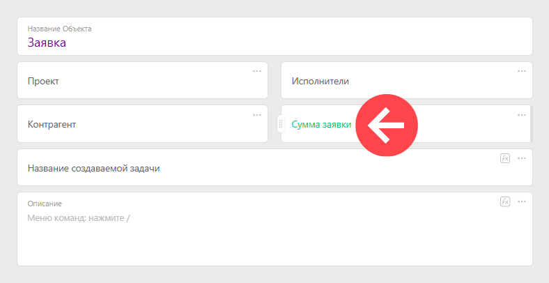

Создание [ пользовательских полей](Пользовательские_поля.md "Пользовательские поля") происходит в разделе **Управление аккаунтом** — **Настраиваемые поля** — **Поля задач** — по кнопке **Новое поле** : 

  * При создании поля можно сразу выбрать, в каком [наборе](Наборы_пользовательских_полей.md "Наборы пользовательских полей") оно будет создано.

  * После создания поля, его можно добавить в нужные [Объекты](Объекты.md "Объекты"), где оно будет отображаться следующим образом:

  

Подробнее об использовании полей в Объектах можно прочитать в этой статье: [Карточка объекта](Карточка_объекта.md "Карточка объекта"). 

## Важно

Вы можете задать [ права доступа](Доступ_к_пользовательским_полям.md "Доступ к пользовательским полям") к пользовательскому полю, чтобы ограничить его видимость для пользователей вашего аккаунта. 

## Альтернативный способ создания пользовательского поля

Создать пользовательское поле можно непосредственно в процессе создания или редактирования [объекта](Объекты.md "Объекты").
