**Пользовательская конфигурация** — это [ конфигурация](Конфигурации.md "Конфигурации"), которую может создать администратор любого аккаунта. Ее предназначение — перенос настроек (набора объектов и связей между ними) в другие аккаунты ПланФикса. Это помогает сохранять наработки и распространять лучшие практики в организации различных бизнес-процессов. 

## Видео инструкция

[Смотреть видео на YouTube](https://www.youtube.com/watch?v=T0jtl892GpE)

  

## Навигация

  * Создание конфигурации

  * Публичная ссылка на пользовательскую конфигурацию

  * [Установка пользовательской конфигурации](Установка_пользовательской_конфигурации.md "Установка пользовательской конфигурации")

## Создание конфигурации

  * Перейдите в **Управление аккаунтом** — **Конфигурации** — **Созданные мной** :

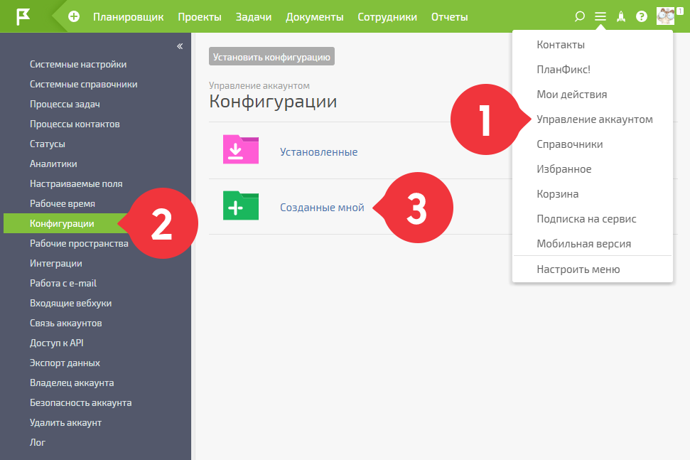

  

  * Нажмите кнопку **Создать конфигурацию** :

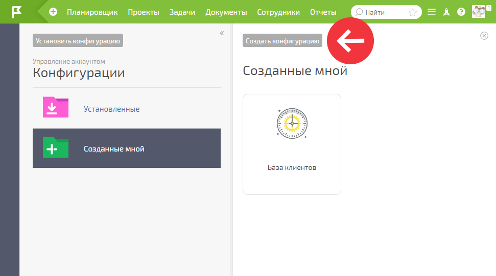

  

В появившемся окне: 

  * Укажите название создаваемой конфигурации. Под этим названием она будет видна в списках конфигураций:

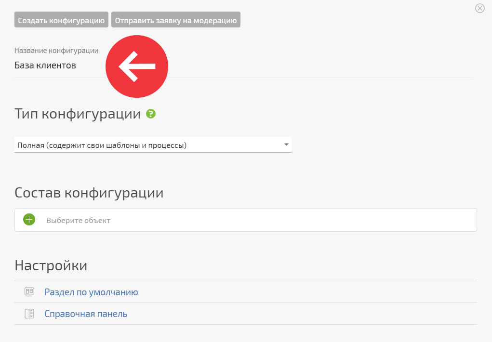

  

  * Заполните описание конфигурации, чтобы вы сами и пользователи, устанавливающие эту конфигурацию в будущем, понимали ее предназначение, какие процессы и как именно она помогает организовать:

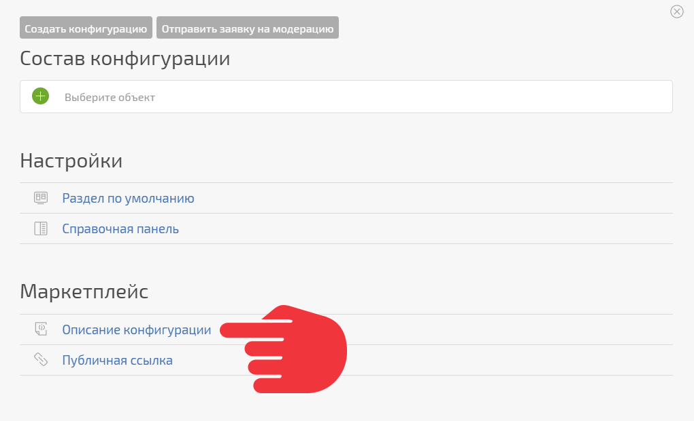

  

  * Выберите тип конфигурации, [ полная или сокращенная](Полная_и_сокращенная_конфигурация.md "Полная и сокращенная конфигурация"):

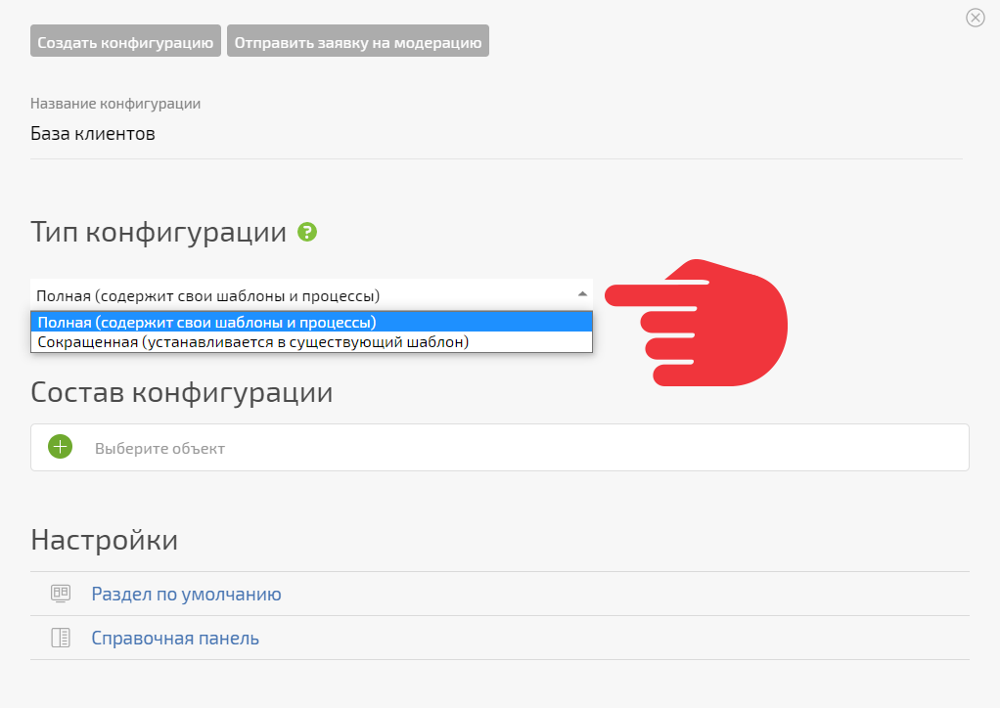

  

  * Выберите типы объектов, которые войдут в конфигурацию:

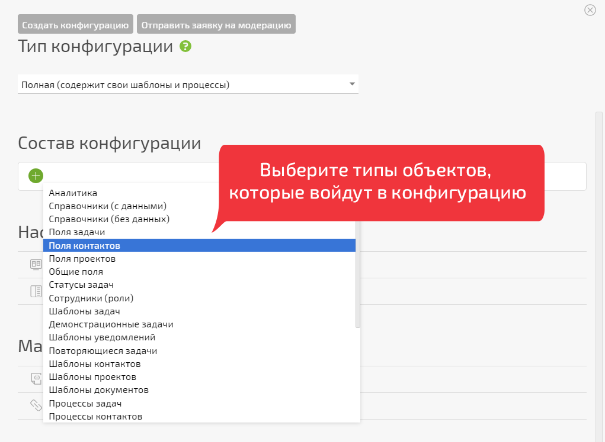

  

  * Каждый выбранный тип объектов появится в виде строки в таблице снизу:

  

  * Кликнув на соответствующую строку, выберите для каждого типа объекты, которые войдут в конфигурацию:

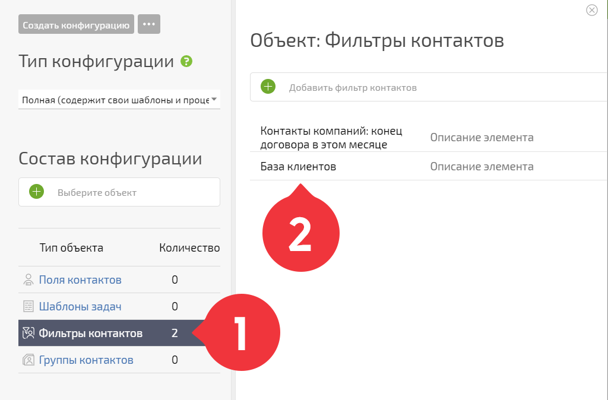

  

    **Важно:** Если вы хотите добавить в конфигурацию дерево шаблонов задач, необходимо выбрать только головной шаблон. Остальные вложенные в него шаблоны будут запакованы в конфигурацию автоматически.

  

  * Укажите, в какой раздел попадет пользователь сразу после установки конфигурации:

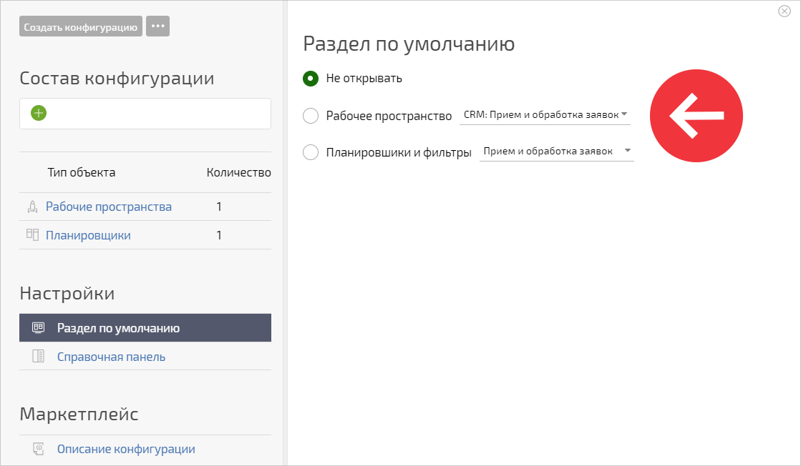

  

    Возможные варианты раздела по умолчанию:

    

  * **Не открывать** — этот вариант выбран по умолчанию.

  * **Рабочее пространство** — отображается, если в конфигурации есть рабочие пространства.

  * **Планировщики и фильтры** — отображается, если они есть в конфигурации.

  

  * Укажите, будет ли сразу после установки конфигурации открываться справочная панель с её описанием:

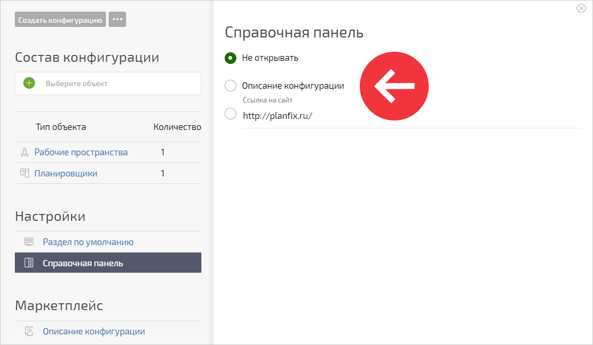

  

    Возможные варианты настройки:

    

  * **Не открывать** — этот вариант выбран по умолчанию.

  * **Описание конфигурации** — в панели открывается описание конфигурации.

  * **Ссылка на сайт** — позволяет разместить любую ссылку, которая будет открыта в фрейме.

  

  * После того, как все будет готово, нажмите **Создать конфигурацию** (сверху). Конфигурация появится в списке, в разделе **Мои конфигурации** :

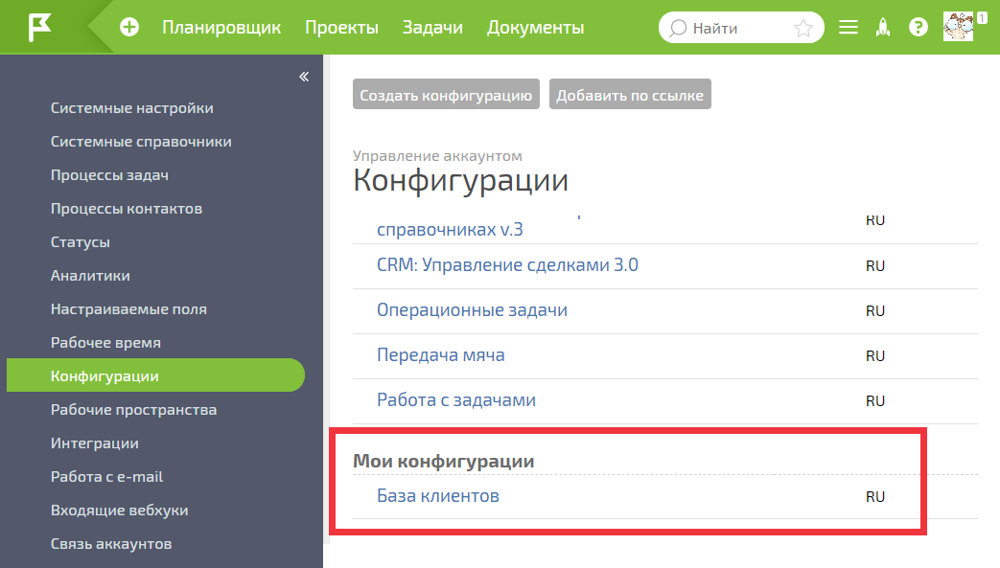

## Публичная ссылка на пользовательскую конфигурацию

Для того, чтобы [установить пользовательскую конфигурацию](Установка_пользовательской_конфигурации.md "Установка пользовательской конфигурации") в другом аккаунте, необходимо сгенерировать публичную ссылку: 

  * Кликните на название пользовательской конфигурации в списке **Мои конфигурации** :

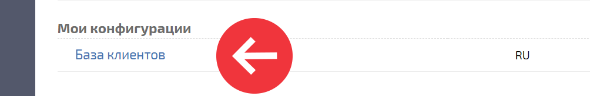

  

  * Для того, чтобы сгенерировать публичную ссылку, нажмите на кнопку **Редактировать** :

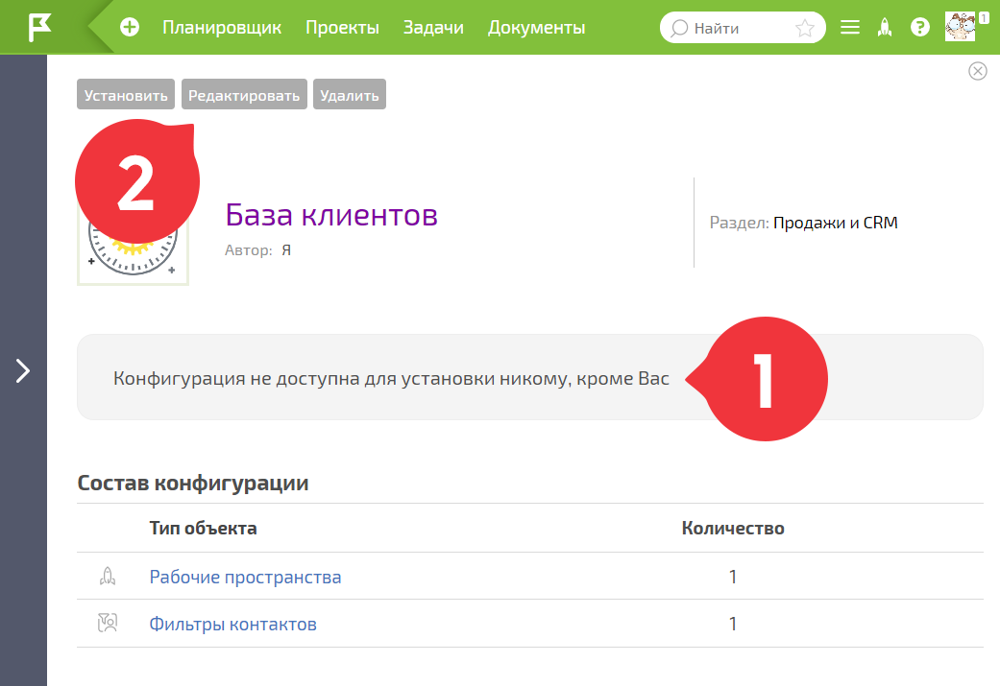

  

  * Сгенерируйте публичную ссылку на вашу конфигурацию:

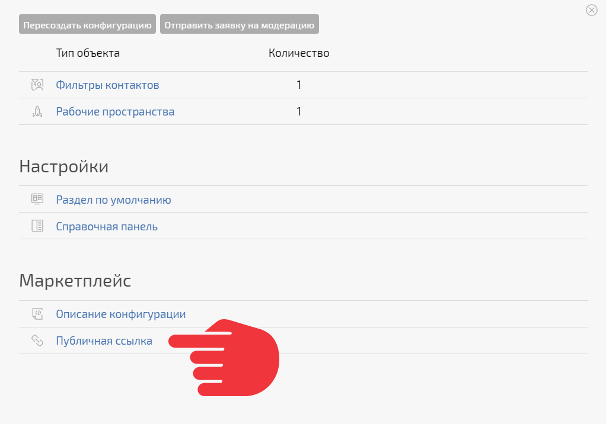

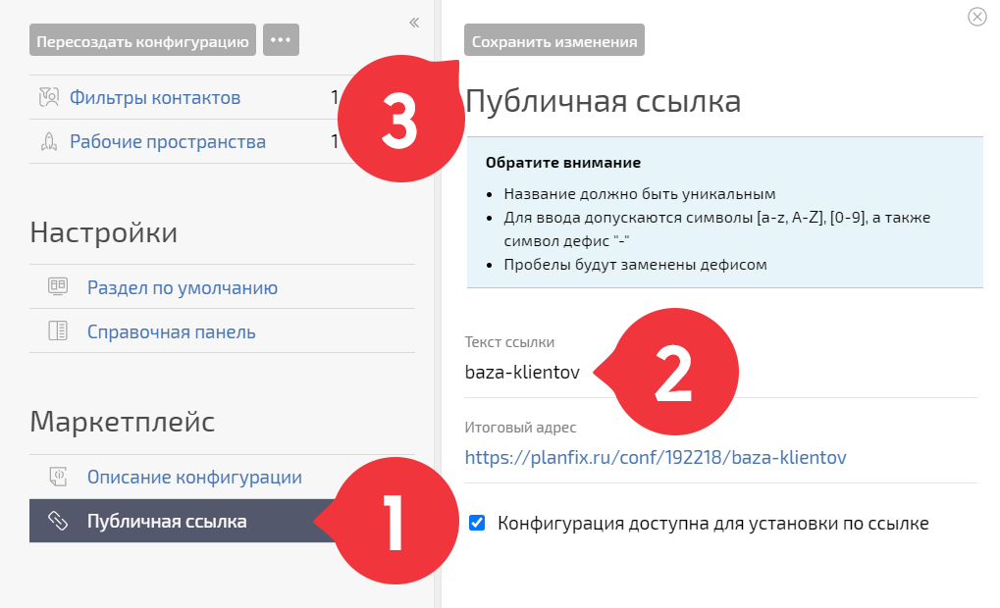

  

  * Сгенерированная публичная ссылка отобразится в конфигурации:

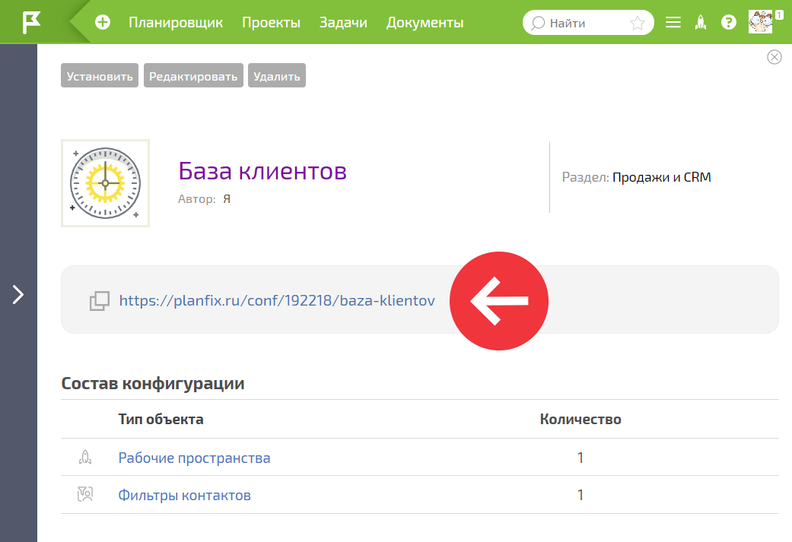

  

Поделитесь этой ссылкой с другими пользователями ПланФикса или [ используйте ее](Установка_пользовательской_конфигурации.md "Установка пользовательской конфигурации") для переноса своих настроек в другой аккаунт. 

Если вы не хотите, чтобы конфигурация была доступна по этой ссылке, перегенерируйте ее. Учтите, что это повлияет только на невозможность новых установок вашей конфигурации по старой ссылке. Конфигурации, которые были установлены до перегенерации ссылки, будут работать. 

## Дополнительная информация

  * Доступ к созданию пользовательских конфигурации есть у администраторов и технических администраторов любого аккаунта.

  * Созданную пользовательскую конфигурацию видит только ее автор. Он же может удалять ее, а также генерировать и перегенерировать публичные ссылки на нее. Другим пользователям аккаунта с правами администратора она недоступна.

  * Для защиты от копирования, содержимое конфигурации можно [ запретить добавлять в другие конфигурации](Запретить_добавление_объектов_этой_конфигурации_в_другие_конфигурации.md "Запретить добавление объектов этой конфигурации в другие конфигурации").
