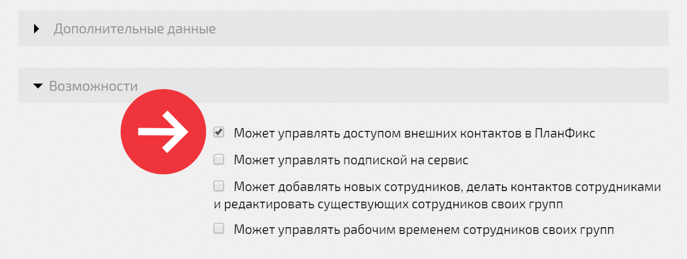
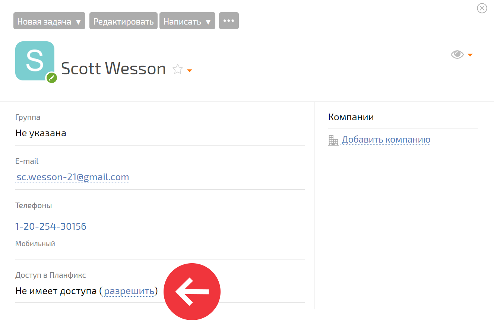

Администратор аккаунта может [ разрешить сотруднику](Дополнительные_возможности_пользователя.md "Дополнительные возможности пользователя") управлять доступом внешних контактов в ПланФикс. Для этого: 

  * зайдите в [ карточку](Страница_пользователя.md "Страница пользователя") нужного пользователя в разделе **Сотрудники** ;

  * нажмите кнопку **Редактировать** ;

  * разверните панель **Возможности**

  * активируйте признак **Может управлять доступом внешних контактов в ПланФикс** :

  

После этого у сотрудника появится возможность предоставлять [ внешним контактам](Внешний_пользователь.md "Внешний пользователь") доступ в ПланФикс: 

