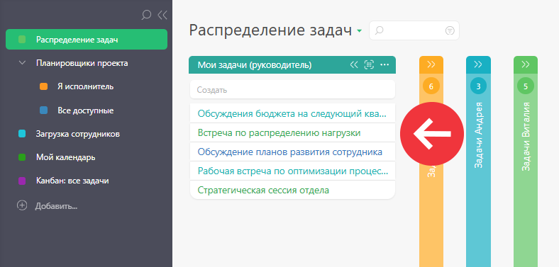
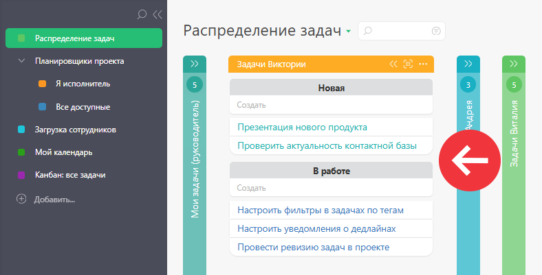
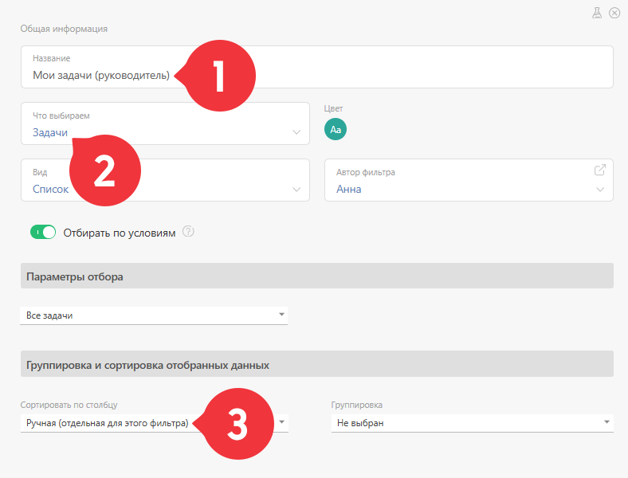

(перенаправлено с «[Список (Планировщик)](index.php.md)&redirect=no "Список \(Планировщик\)")»)

Список — это [ вид списка планировщика](Виды_списков_планировщика.md "Виды списков планировщика"), в котором задачи или контакты отображаются в виде простого списка: 

  

Список может быть как линейным, так и сгруппированным. Группировка влияет на внешний вид списка и на параметры создаваемых в нем [ быстрым](Быстрое_создание_задачи_в_списке.md "Быстрое создание задачи в списке") или [ расширенным](Создание_задачи/контакта_в_списке.md "Создание задачи/контакта в списке") образом задач. 

Например, внешний вид типа "Список" и задачи сгруппированы по статусам: 

  

Группировка влияет на свойства перетаскиваемых в группу задач: они изменяются для того, чтобы соответствовать параметрам группы. Например, перетащив задачу в группу списка, который сгруппирован по статусам, вы измените статус этой задачи на указанный в этой группе. 

## Параметры настройка списка типа "Список задач/контактов"

При [ создании](Как_создать_планировщик.md "Как создать планировщик") или редактировании списка планировщика типа **Список** , вы можете настроить основные и дополнительные параметры, влияющие на его функциональность и внешний вид: 

  

Доступны следующие параметры: 

  * [ Тип объектов, отображающихся в списке ](Отображение_объектов_в_списке_планировщика.md "Отображение объектов в списке планировщика")

  * [Параметры отбора объектов](Параметры_отбора_объектов.md "Параметры отбора объектов")

  * [Цвет заголовка списка](Цвет_заголовка_списка.md "Цвет заголовка списка")

  * Признак [Использовать полную форму](Использовать_полную_форму.md "Использовать полную форму")

  * Признак [Скрывать поле создания нового объекта](Скрывать_поле_создания_нового_объекта.md "Скрывать поле создания нового объекта")

  * Признак [Автоматически сворачивать пустой список](Автоматически_сворачивать_пустой_список.md "Автоматически сворачивать пустой список")

  * Признак [ Отображать блок итогов](Итоги_в_Планировщике.md "Итоги в Планировщике")

  * [ Отображение карточки задачи / контакта](Настройка_отображения_карточки_в_планировщике.md "Настройка отображения карточки в планировщике")

## Полезно

  * В процессе работы, вы можете использовать [расширенное отображение списков планировщика](Расширенное_отображение_списков_планировщика.md "Расширенное отображение списков планировщика").

  * Списки можно [располагать один под другим](Управление_внешним_видом_планировщика.md "Управление внешним видом планировщика"), для более компактного отображения.
