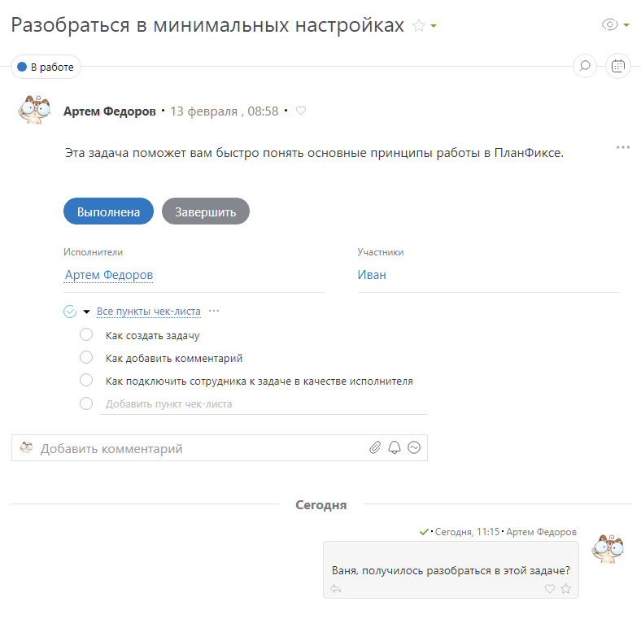
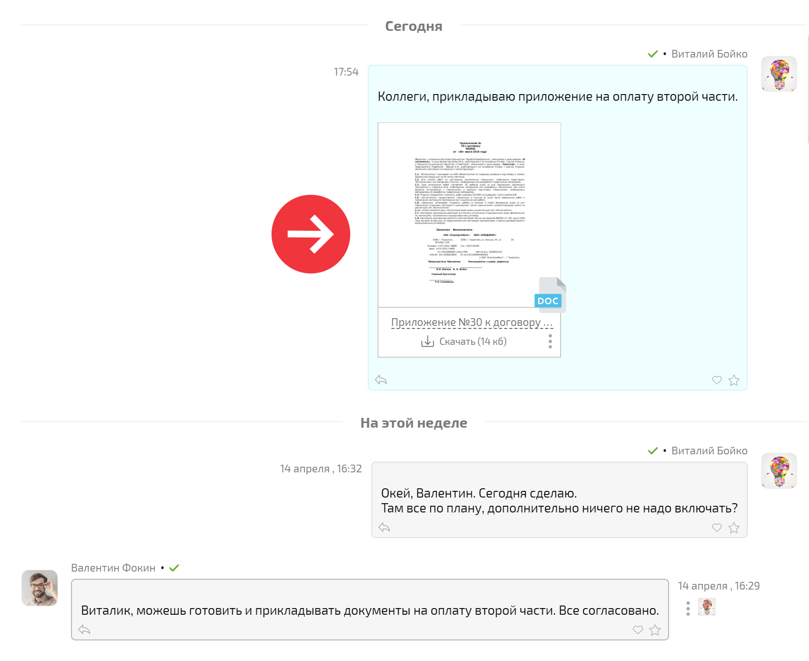
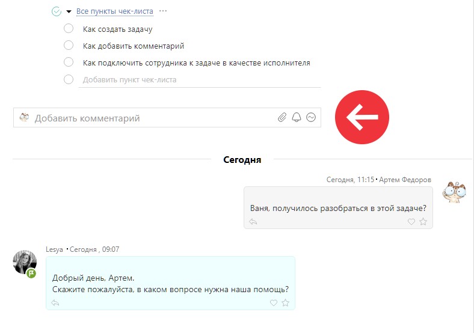
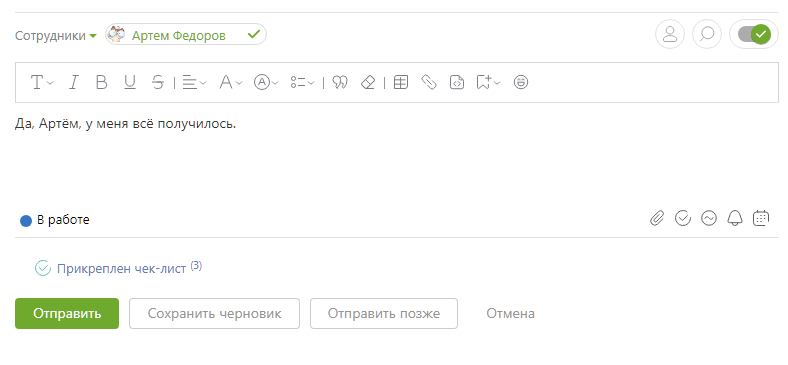

Для того, чтобы переключится на старый вид отображения [ленты комментариев](Лента_действий_по_задаче.md "Лента действий по задаче") необходимо: 

  * Перейти в профиль сотрудника — Настройки — Оформление.

  * Деактивировать новый вид отображения ленты комментариев:

Основное отличие старого вида ленты комментариев задачи от чата заключается в том, что в нём при открытии задачи сразу видны все элементы: описание, чек-лист, поля и комментарии. Переключаться между ними, как в чате, не надо. Такое положение элементов является как плюсом, так и минусом этого вида отображения: 

  * Плюс — всё видно сразу.

  * Минус — комментарии могут физически не поместиться на экран, если в описании или чек-листе много всего добавлено:

  

Цвет комментария нельзя отобразить узкой полосой слева, как в чате. Цветом выделяется весь фон комментария: 

  

Поле добавления комментария находится сразу под чек-листом, а лента комментариев всегда ниже: 

  

Все элементы управления и действий над комментарием всегда отображаются. Форма добавления комментария выглядит визуально перегруженной, многие элементы не всегда нужны при общении в задаче: 

