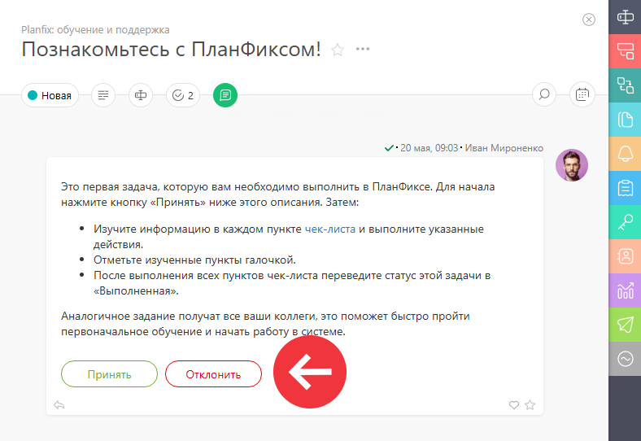
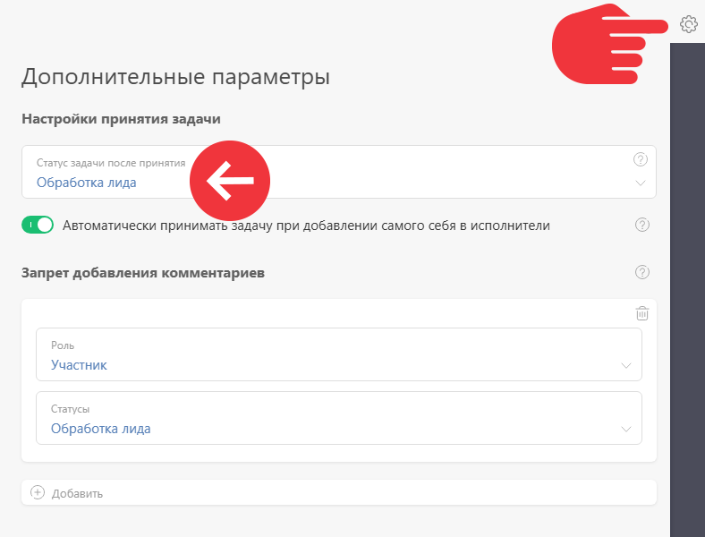

Когда [ задача](Задачи.md "Задачи") находится в [ статусе "Новая"](Новая__(статус_задачи_.md) "Новая \(статус задачи\)"), в ней отображаются [ кнопки Принять и Отклонить](Кнопки_Принять_и_Отклонить.md "Кнопки Принять и Отклонить"), при помощи которых исполнитель может взять задачу в работу, либо отказаться от нее: 

  

Настройка **Статус, в который будет переводиться задача по нажатию на кнопку "Принять"** позволяет выбрать статус, в который задача будет автоматически переведена после принятия. 

Эта настройка расположена в верхней части окна [ дополнительных параметров набора статусов](Дополнительные_параметры_набора_статусов.md "Дополнительные параметры набора статусов"): 

  

## Дополнительная информация

  * В настройках по умолчанию, после принятия задача будет переведена в статус **В работе**.

  * Для каждого [ процесса](Процессы.md "Процессы") существует свой [ набор статусов](Создание_набора_статусов.md "Создание набора статусов"), поэтому вы можете управлять тем, в какой статус будет переводиться задача после принятия, на уровне конкретного процесса.
