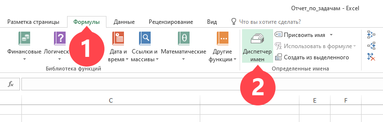
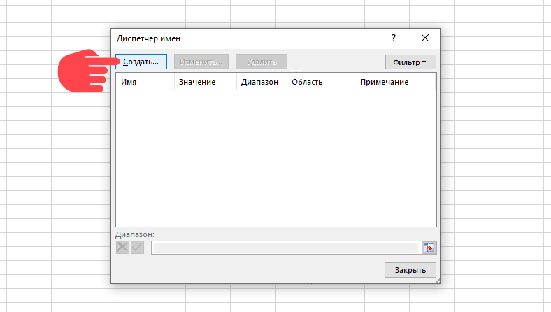
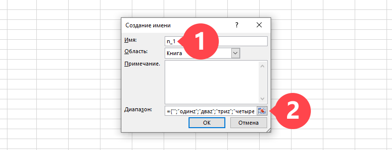
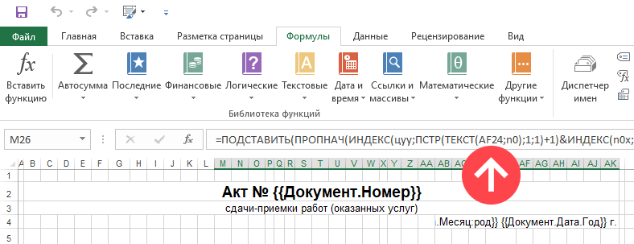

В некоторых случаях в [ шаблонах документов](Шаблоны_документов.md "Шаблоны документов") форматов Microsoft Excel / Word есть необходимость в отображении итоговой суммы прописью. Для это вы можете взять готовый [пример шаблона](https://planfix.ru/files/%D0%90%D0%BA%D1%82%20%D0%B2%D1%8B%D0%BF%D0%BE%D0%BB%D0%BD%D0%B5%D0%BD%D0%BD%D1%8B%D1%85%20%D1%80%D0%B0%D0%B1%D0%BE%D1%82.xlsx) с отображением суммы прописью и просто внести в него свои данные. 

Если же у вас уже есть готовый документ с заполненными данными и вам необходимо добавить возможность написания суммы прописью, то чтобы формула заработала, необходимо в Excel / Word добавить справочники, которые использует формула. Справочники задаются как именованные диапазоны. 

## Создание именованных диапазонов

Чтобы создать справочник таких диапазонов, в Excel перейдите на вкладку Формулы — Диспетчер имен: 

  

Нажмите кнопку "Создать": 

  

Задайте "Имя" диапазона и сам диапазон: 

  

Вам необходимо создать следующие диапазоны: 

  

Имя диапазона: **n_1**

Диапазон: **={"";"одинz";"дваz";"триz";"четыреz";"пятьz";"шестьz";"семьz";"восемьz";"девятьz"}**

  

Имя диапазона: **n_2**

Диапазон: **={"десятьz";"одиннадцатьz";"двенадцатьz";"тринадцатьz";"четырнадцатьz";** **"пятнадцатьz";"шестнадцатьz";"семнадцатьz";"восемнадцатьz";"девятнадцатьz"}**

  

Имя диапазона: **n_3**

Диапазон: **={"":1:"двадцатьz":"тридцатьz":"сорокz":"пятьдесятz":"шестьдесятz":** **"семьдесятz":"восемьдесятz":"девяностоz"}**

  

Имя диапазона: **n_4**

Диапазон: **={"";"стоz";"двестиz";"тристаz";"четырестаz";"пятьсотz";"шестьсотz";** **"семьсотz";"восемьсотz";"девятьсотz"}**

  

Имя диапазона: **n_5**

Диапазон: **={"";"однаz";"двеz";"триz";"четыреz";"пятьz";"шестьz";"семьz";"восемьz";"девятьz"}**

  

Имя диапазона: **n0**

Диапазон: **="000000000000" &ПСТР(1/2;2;1)&"00"**

  

Имя диапазона: **n0x**

Диапазон: **=ЕСЛИ(n_3=1;n_2;n_3 &n_1)**

  

Имя диапазона: **n1x**

Диапазон: **=ЕСЛИ(n_3=1;n_2;n_3 &n_5)**

  

Имя диапазона: **мил**

Диапазон: **={0;"овz":1;"z":2;"аz":5;"овz"}**

  

Имя диапазона: **тыс**

Диапазон: **={0;"тысячz":1;"тысячаz":2;"тысячиz":5;"тысячz"}**

  

Имя диапазона: **цуу**

Диапазон: **={"";"стоz";"двестиz";"тристаz";"четырестаz";"пятьсотz";"шестьсотz"; "семьсотz";"восемьсотz";"девятьсотz"}**

## Вставка формулы в новый документ

После задания диапазонов скопируйте формулу из шаблона и вставьте ее в ваш документ в ячейку, где необходимо отобразить число прописью, а в самой формуле замените адрес на адрес той ячейки, где располагается исходное число: 

