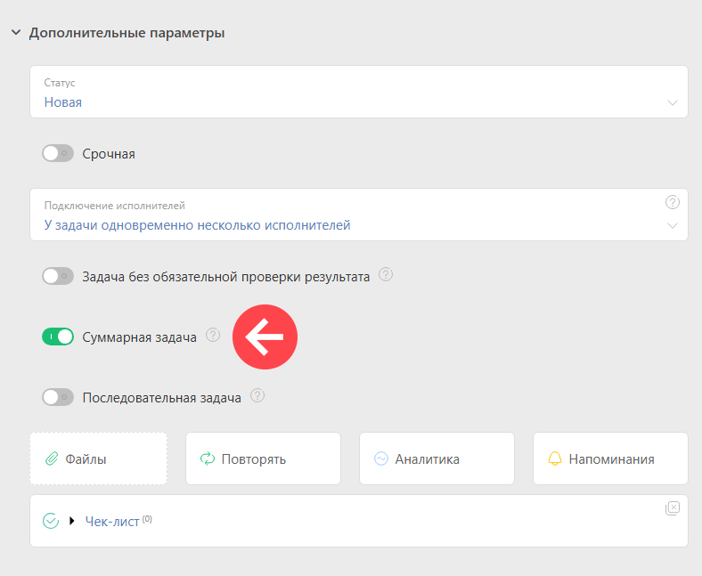

**Суммарная задача** \- это [ задача](Задачи.md "Задачи"), даты планируемого начала и завершения которой автоматически рассчитываются на основании дат её подзадач. Датой её начала является наименьшая из дат начала, а датой завершения — наибольшая из дат завершения подзадач. 

Чтобы сделать задачу суммарной, необходимо отметить соответствующий признак в форме создания задачи, во вкладке **Дополнительные параметры** : 

