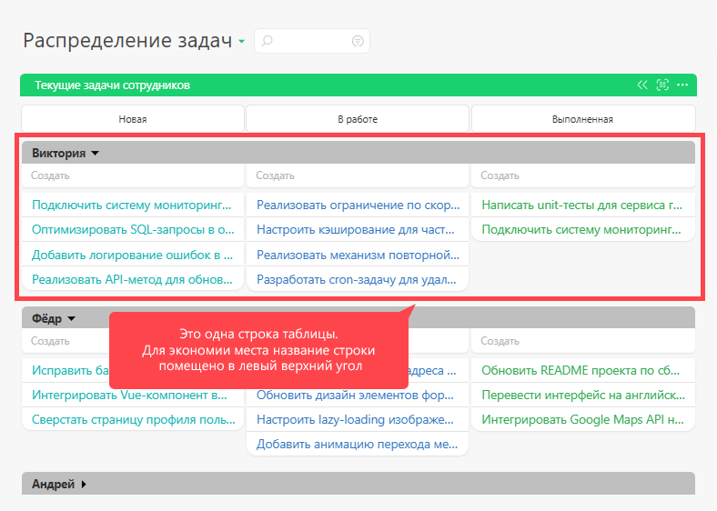
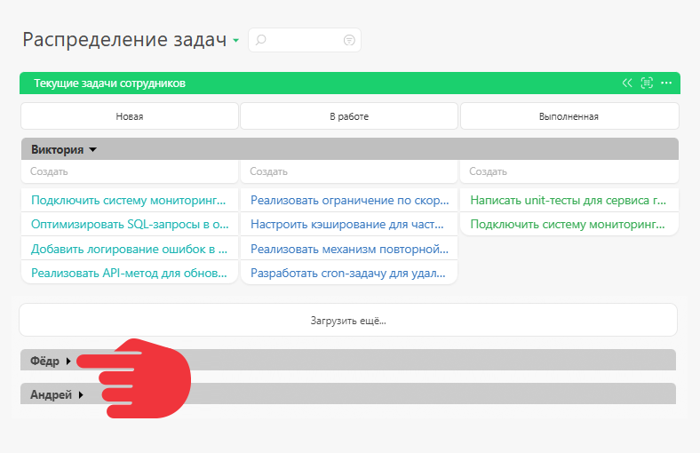

Выбор [ вида отображения](Виды_списков_планировщика.md "Виды списков планировщика") списка [ Планировщика](Планировщик.md "Планировщик") **Таблица** приводит к отображению задач и контактов в форме таблицы. При этом вы можете выбирать, данные из каких полей будут отображаться в строках и столбцах этой таблицы: 

  

Как и в других [ видах списков](Виды_списков_планировщика.md "Виды списков планировщика"), задачи отбираются согласно заданным параметрам, и отображаются согласно указанной группировке и сортировке по выбранным строкам и столбцам: 

## Дополнительные параметры настройки списка типа "Таблица"

Помимо специфичных для этого типа списка настроек, доступны следующие стандартные параметры: 

  * [ Тип объектов, отображающихся в списке ](Отображение_объектов_в_списке_планировщика.md "Отображение объектов в списке планировщика")

  * [Параметры отбора объектов](Параметры_отбора_объектов.md "Параметры отбора объектов")

  * Настройки календарной сетки (для случаев, когда она применима)

  * Блок синхронизации с [Google Contacts](Google_Contacts.md "Google Contacts") (если в таблице отображаются контакты)

  * [Цвет заголовка списка](Цвет_заголовка_списка.md "Цвет заголовка списка")

  * Признак [Открывать в новой вкладке](Открывать_в_новой_вкладке.md "Открывать в новой вкладке")

  * Признак [Скрывать поле создания нового объекта](Скрывать_поле_создания_нового_объекта.md "Скрывать поле создания нового объекта")

  * Признак [Автоматически сворачивать пустой список](Автоматически_сворачивать_пустой_список.md "Автоматически сворачивать пустой список")

  * [ Отображение карточки задачи / контакта](Настройка_отображения_карточки_в_планировщике.md "Настройка отображения карточки в планировщике")

  * Признак [ Отображать блок итогов](Итоги_в_Планировщике.md "Итоги в Планировщике")

## Особенности вида отображения Таблица

  * И для строк, и для столбцов в общем случае необходимо перечислить конкретные значения. То есть, недостаточно указать “По исполнителям” — нужно указать, каких именно исполнителей вы хотите видеть в данном случае.

  * В каждую из строк загрузится до 50 задач, а если строк нет, то до 150 задач в Таблицу в принципе. Если под условия фильтра подходит больше задач, их можно подгружать порциями, нажимая на специальную кнопку внизу списка:

  

  * Группировки-строки можно сворачивать:

  

  * В Таблице работает перетаскивание, причем в полном соответствии с общими правилами Планировщика — задача приобретает реквизиты той “ячейки”, в которой очутилась. Перемещать задачи можно как внутри Таблицы, так и между ней и другими списками текущего планировщика.

## Важно

  * Вид Таблица предназначен для небольшого количества задач (в пределах 50 на строку таблицы). При бОльшем количестве Таблица будет работать достаточно медленно, при этом может создаваться ложное ощущение, что задач нет в каком-то из столбцов, хотя они просто не загружены, так как загружаются сразу не все задачи.

  * Параметры отбора в этот список планировщика влияет также на параметры создаваемых в нем [ быстрым](Быстрое_создание_задачи_в_списке.md "Быстрое создание задачи в списке") или [ расширенным](Создание_задачи/контакта_в_списке.md "Создание задачи/контакта в списке") образом задач и контактов.

## Типы полей, по которым можно строить таблицу

**Тип поля** | **Столбцы** | **Строки**  

---|---|---  

Группа, сотрудник или контакт  | да  | да   

Дата  | да  | да   

Дата и время  | да  | да   

Запись справочника  | да  | да   

Контакт  | да  | да   

Контрагент  | да  | да   

Набор задач  | да  | нет   

Набор значений справочника  | да  | нет   

Проект  | да  | да   

Сотрудник  | да  | да   

Список  | да  | да   

Список пользователей  | да  | нет
