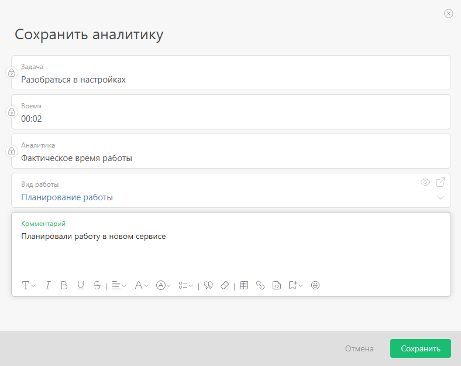
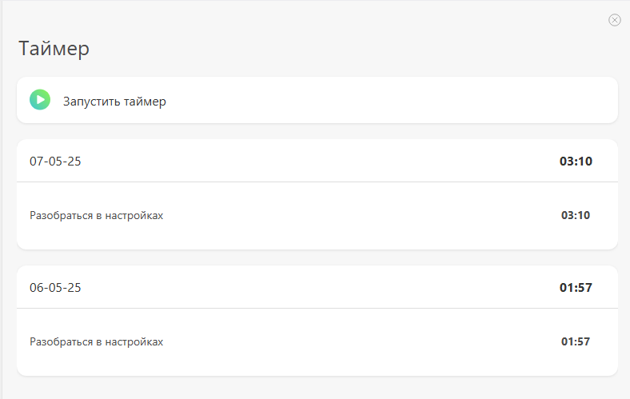
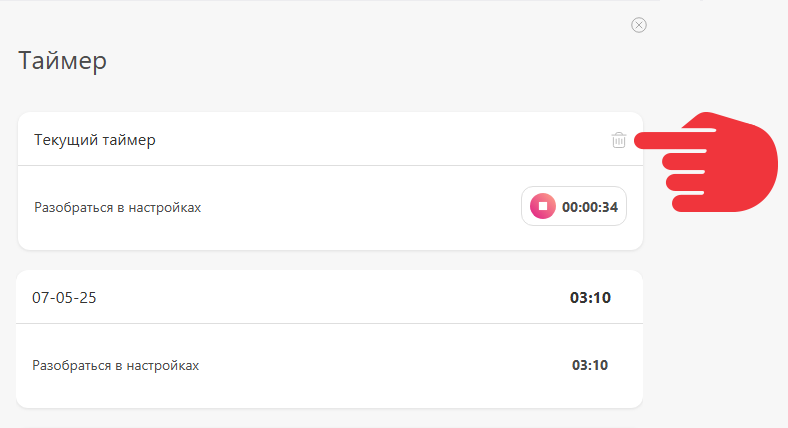

Для быстрого [учёта времени](Учет_рабочего_времени.md "Учет рабочего времени"), отработанного по задачам, удобно использовать таймер. Он доступен и в [мобильном приложении](Таймер_в_мобильном_приложении.md "Таймер в мобильном приложении"). Каждый сотрудник должен самостоятельно включить его себе в ПланФиксе — [в карточке сотрудника](Страница_пользователя.md "Страница пользователя") — Настройки — Личные настройки — Встроенный таймер. 

## Как пользоваться таймером

Перед использованием таймера: 

  * Установите конфигурацию [«Учет рабочего времени»](Учет_рабочего_времени.md "Учет рабочего времени") из маркетплейса ПланФикса.

  * Затем откройте задачу и запустите таймер, нажав иконку часиков в правом верхнем углу.

  * Если остановить таймер, откроется окно добавления аналитики. Первые три пункта в нём изменить нельзя. Далее укажите вид работы, а в комментарии напишите, что сделали:

  

  * Сохраните аналитику. Все сохранённые аналитики отобразятся ниже:

  

Сбросить таймер, не фиксируя аналитику, можно по кнопке: 

## Важно

  * Одинаковые аналитики, добавленные в течении дня, объединяются в одну общую запись в истории, а их время суммируется. Это сделано для удобства, чтобы не загромождать историю лишними одинаковыми записями.

## Дополнительная информация

  * Заметка в блоге: [Таймер стал частью ПланФикса](https://planfix.com/ru/blog/tajmer-stal-chastyu-planfiksa/)
