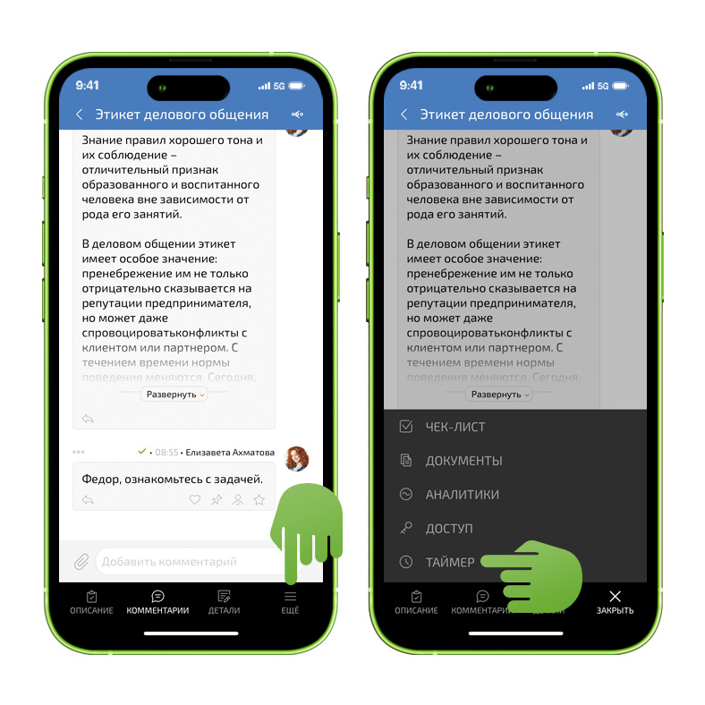
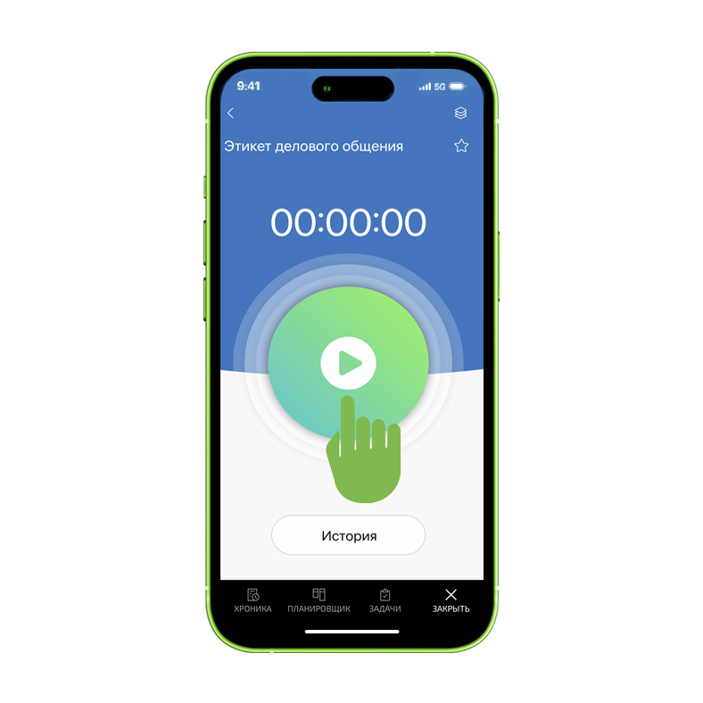
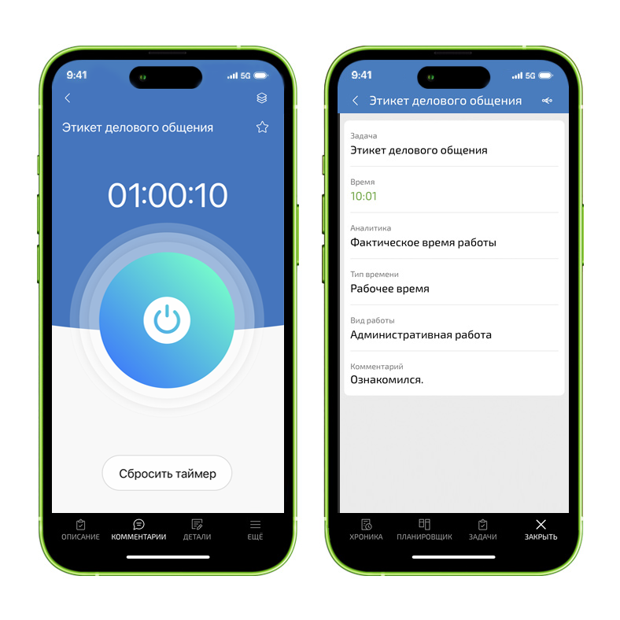
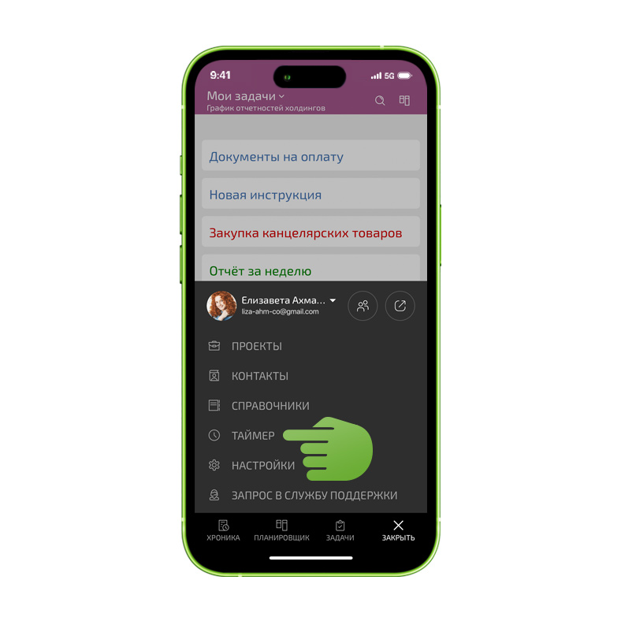
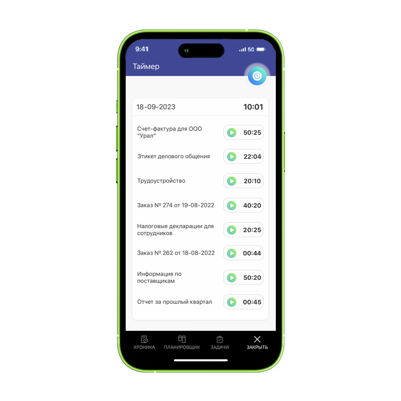
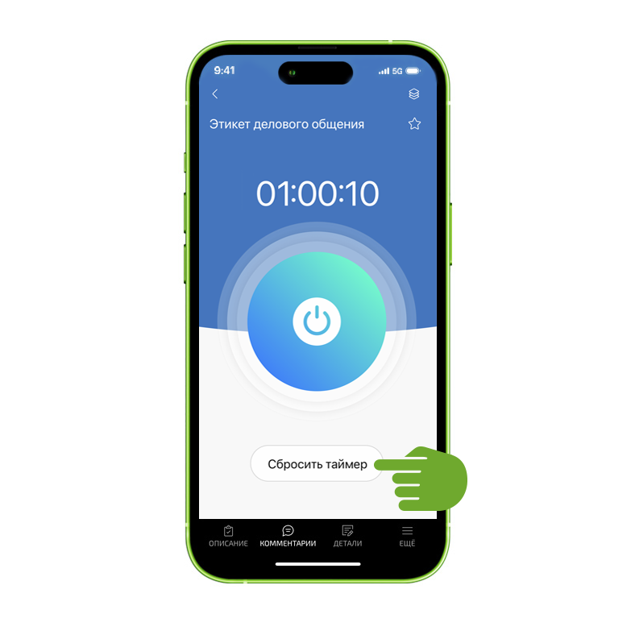

С помощью таймера удобно учитывать время, отработанное по задачам. Для начала работы таймера: 

  * Проверьте наличие установленной в вашем аккаунте конфигурации [Учет рабочего времени](Учет_рабочего_времени.md "Учет рабочего времени"). Установить [конфигурацию](https://planfix.ru/conf/partner/160/time-tracking) можно в [маркетплейсе](https://planfix.ru/configurations) ПланФикса.

  * Включите таймер в вашем аккаунте на веб-сайте, как описано в [справке](Таймер.md "Таймер"). Если таймер работает исправно, то он будет доступен в мобильном приложении.

## Как пользоваться таймером

Чтобы использовать таймер пройдите в задачу, над которой планируется работа, нажмите **«Еще»** и выберете **«Таймер»** : 

  

Затем запустите таймер: 

  

Когда работа над задачей завершена, нажмите кнопку остановки таймера, откроется окно добавления аналитики. Первые три пункта в нём изменить нельзя. Далее укажите тип и вид работы, а в комментарии напишите, что сделали: 

  

Если вы вышли из задачи, над которой работали, не оставновив таймер, в него можно вернуться нажав **«Еще» — «Таймер»** на нижней панели интерфейса: 

  

Сохраните аналитику. Сохранённые аналитики попадают в раздел **«История»** : 

  

Сбросить таймер, не фиксируя аналитику, можно по кнопке: 

## Важно

  * Одинаковые аналитики, добавленные в течении дня, объединяются в одну запись в истории, а их время суммируется. Это сделано для удобства, чтобы не загромождать историю одинаковыми записями.
