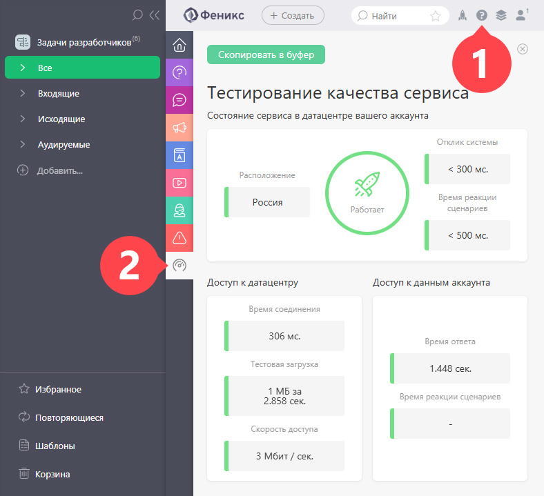

ПланФикс предоставляет пользователям доступ к технической информации [ аккаунта](Аккаунт.md "Аккаунт"). В неё входит: 

  * Ваш IP

  * Состояние сервиса в датацентре вашего аккаунта

  * Скорость доступа к: 

    * датацентру

    * данным аккаунта

    * файлам c вашего IP

  * Состояние кэша

Панель тестирования качества сервиса легко найти, кликнув на иконку вызова Справки: 

  

В случае возникновения проблем информация, представленная на панели, поможет определить уровень, на котором они происходят: датацентр, интернет-канал или устройство пользователя.
