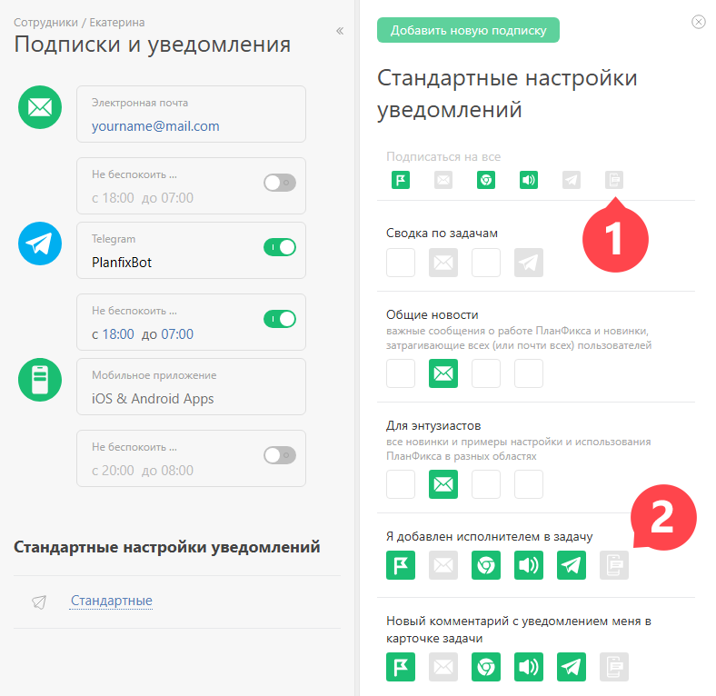

Для получения уведомлений в мобильном приложении ПланФикса необходимо активировать канал "Мобильное приложение" в веб-версии системы. Для этого перейдите в разделе Мой профиль — [Уведомления](Подписки_и_уведомления.md "Подписки и уведомления") и нажмите на иконку канала: 

    _Обратите внимание, иконка отображается только тогда, когда вы одновременно авторизованы в одном и том же аккаунте в веб-версии и мобильном приложении._

  

Зеленый цвет пиктограмм в списке уведомлений говорит об активности канала. При появлении нового события соответствующего типа, вы получите уведомление об этом на телефон. 

## Полезно

  * Вы можете включить отправку в мобильное приложение только некоторых типов событий, например, новые задачи или комментарии в ваш адрес. Для этого активируйте только желаемые события кликом на иконку в соответствующей строке.

  * В [настройках мобильного приложения для Andriod](Настройки_мобильного_приложения.md "Настройки мобильного приложения") есть аналогичная настройка уведомлений. Работа таких уведомлений не зависит от того, были они активированы в веб-версии ПланФикса или в мобильном приложении.
