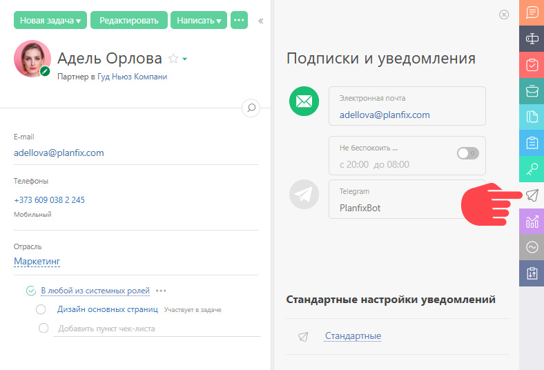

ПланФикс позволяет настроить уведомления для [контактов с доступом](Внешний_пользователь.md "Внешний пользователь") и [контактов без доступа](Как_работать_с_клиентом_по_e-mail_.md "Как работать с клиентом по e-mail?"). 

  * [Уведомления для контактов с доступом](Уведомления_для_контактов_с_доступом.md "Уведомления для контактов с доступом") — настраиваются персонально во вкладке "Подписки и Уведомления" в карточке контакта:

  

  * [Уведомления для контактов без доступа](Уведомления_для_контактов_без_доступа.md "Уведомления для контактов без доступа") — едины для всего аккаунта и настраиваются в разделе Управление аккаунтом — Работа с e-mail — Уведомления внешних контактов.

## Важно

  * Если получатель отметит письмо, полученное от ПланФикса, как [спам](Если_получатель_отправляет_уведомления_в_спам.md "Если получатель отправляет уведомления в спам"), отправка уведомлений по электронной почте ему будет остановлена до получения от него входящего письма в ПланФикс.
