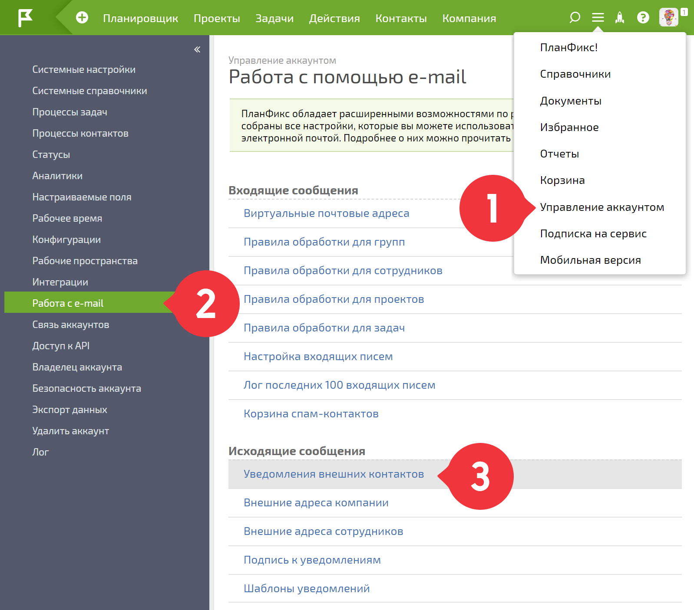
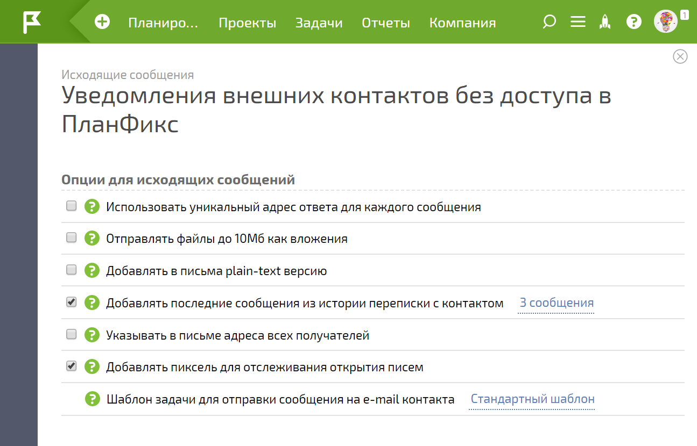
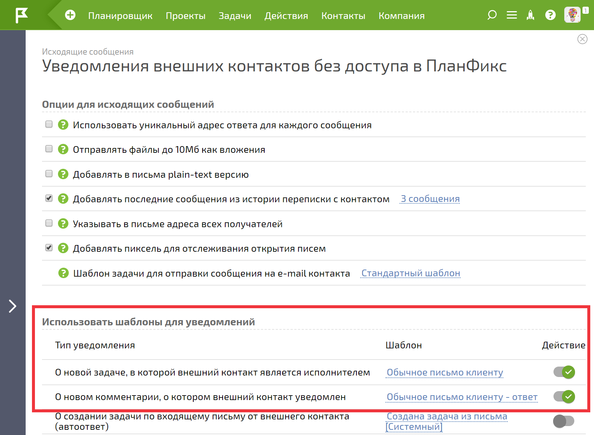
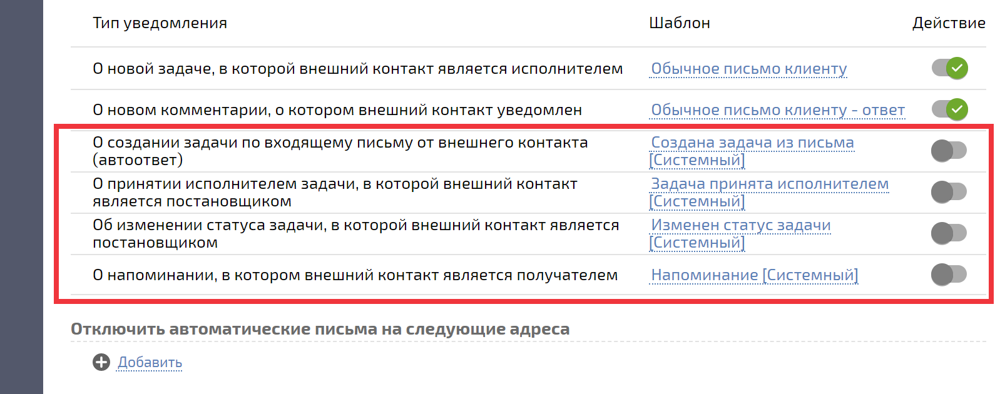
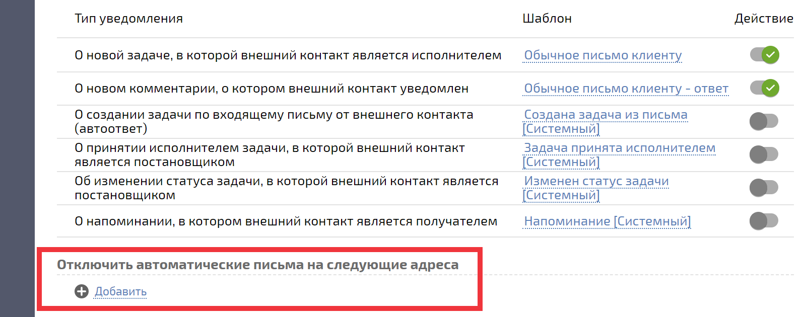

Уведомления для контактов без доступа и [шаблоны для этих уведомлений](Шаблоны_писем-уведомлений_для_контактов_без_доступа_в_ПланФикс.md "Шаблоны писем-уведомлений для контактов без доступа в ПланФикс") настраиваются в разделе **Управление аккаунтом - Работа с e-mail - Уведомления внешних контактов** : 

  

## Опции для исходящих сообщений

  

Доступны следующие опции: 

  * [Использовать уникальный адрес ответа для каждого сообщения](Использовать_уникальный_адрес_ответа_для_каждого_сообщения.md "Использовать уникальный адрес ответа для каждого сообщения")

  * [ Отправлять файлы до 10Мб как вложения](Отправка_файлов_в_виде_вложений.md "Отправка файлов в виде вложений")

  * [Добавлять в письма plain-text версию](Добавлять_в_письма_plain-text_версию.md "Добавлять в письма plain-text версию")

  * [ Добавлять в письма последние сообщения из истории переписки с контактом](История_переписки_в_письмах_для_контактов_без_доступа_в_ПланФикс.md "История переписки в письмах для контактов без доступа в ПланФикс")

  * [Указывать в письме адреса всех получателей](Указывать_в_письме_адреса_всех_получателей.md "Указывать в письме адреса всех получателей")

  * [Добавлять пиксель для отслеживания открытия писем](Добавлять_пиксель_для_отслеживания_открытия_писем.md "Добавлять пиксель для отслеживания открытия писем")

  * [Шаблон задачи для отправки сообщения на e-mail контакта](Шаблон_задачи_для_отправки_сообщения_на_e-mail_контакта.md "Шаблон задачи для отправки сообщения на e-mail контакта")

  

## Шаблоны для уведомлений

**Основные:**

  * Новая задача, поставленная контакту

  * Новый комментарий, о котором уведомлен контакт:

  

**Дополнительные,** которые включаются опционально: 

  * Создание задачи по входящему письму от внешнего контакта (автоответ)

  * Принятие исполнителем задачи, в которой внешний контакт является постановщиком

  * Изменение статуса задачи, в которой внешний контакт является постановщиком:

  

**Обратите внимание:** Дополнительные уведомления по умолчанию отключены. 

  

Также можно указать на какие почтовые адреса не отправлять автоматические письма: 

  

На эти адреса не будут отправляться: 

  * автоответы;

  * уведомления из задач;

  * письма, отправляемые автоматическими сценариями.

  

## Важно

  * В случае, если постановщиком задачи является внешний контакт без доступа и исполнителем этой задачи назначается другой внешний контакт без доступа, уведомления этому контакту-исполнителю не отправляются.
