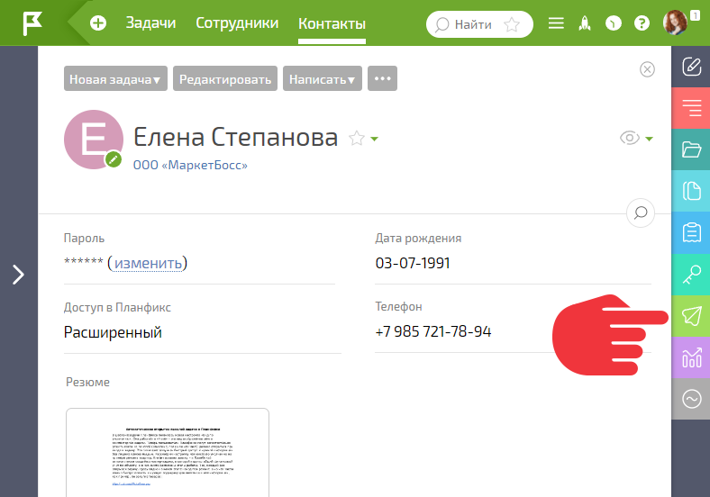
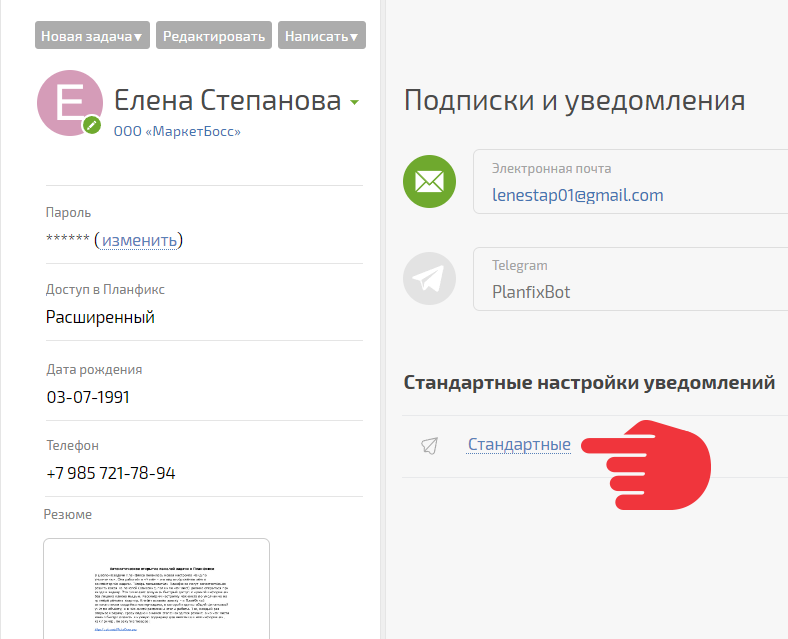
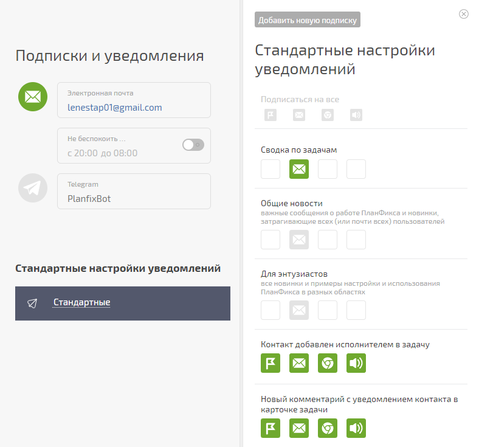
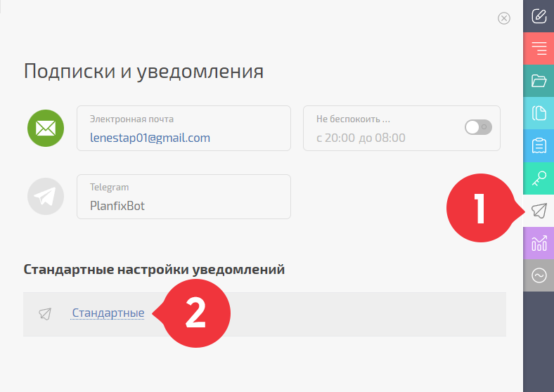
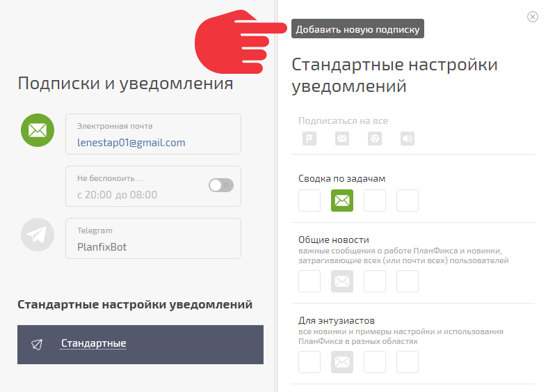
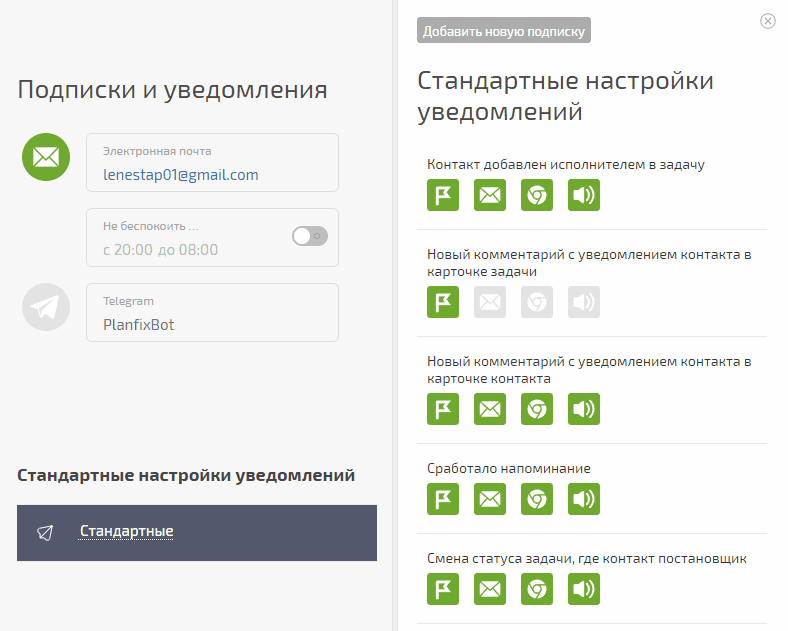

Настраивать уведомления может сам контакт и сотрудник, имеющий [ права на редактирование](Доступ_к_контактам.md "Доступ к контактам") этого контакта. При этом включить уведомления по каналу Telegram и Skype может только сам пользователь. Уведомления для контактов с доступом настраиваются во вкладке Подписки и Уведомления в [карточке контакта](Карточка_контакта.md "Карточка контакта"): 

  

На этой вкладке настраивается вид получаемых контактом уведомлений и способ их доставки: 

  

## Каналы доставки

На текущий момент доступны следующие каналы доставки уведомлений: 

  * [Хроника](Хроника.md "Хроника") \- находится внутри ПланФикса и является наиболее удобным способом получения уведомлений. Подробнее об этом: [Как правильно пользоваться Хроникой ПланФикса](https://planfix.com/ru/blog/kak-pravilno-polzovatsya-xronikoj/)

  * **E-mail** \- пользователь получает уведомления на указанный при регистрации адрес. По умолчанию этот вариант уведомлений включен, т.к. электронная почта все еще остается наиболее распространенным и привычным способом коммуникаций. Но мы настоятельно рекомендуем после первичного знакомства с системой отключить этот способ уведомлений и использовать уведомления через раздел "ПланФикс!"

  * **Skype** \- позволяет получать уведомления в Skype. Подробнее: [Настройка уведомлений в Skype](Настройка_уведомлений_в_Skype.md "Настройка уведомлений в Skype").

  * **Telegram** \- позволяет получать уведомления в [Telegram](https://telegram.org/) и адресно отвечать на эти уведомления (ответ попадает в задачу, из которой пришло уведомление). Процесс настройки описан тут: [Уведомления в Telegram](https://planfix.com/ru/blog/uvedomleniya-v-telegram/)

  * **Оповещения в браузере** \- представляют собой всплывающие окна с текстом уведомлений, которые появляются в системе, если в одной из вкладок браузера открыт ПланФикс

  * **Звуковые оповещения** \- звуковой сигнал, который раздается при появлении нового уведомления (часто используется в сочетании с оповещением в браузере).

  

## Добавление новой подписки

Для добавления новой подписки нужно зайти в [карточку контакта](Карточка_контакта.md "Карточка контакта"), и на боковой панели выбрать пункт **Подписки и уведомления.** Затем в блоке **Стандартные настройки уведомлений** справа внизу выбрать **Стандартные**. 

  

При необходимости можно добавить дополнительные подписки. Для этого нужно нажать кнопку **Добавить новую подписку** внизу списка существующих подписок и выбрать из выпадающего списка нужный вариант. 

  

Также существует возможность установить дополнительное расширение для браузера Google Chrome, которое позволяет отмечать новые действия прочитанными, не переключаясь в ПланФикс. [Подробнее об этом](https://planfix.com/ru/blog/malenkie-novosti/). 

  

## Настройка подписки

Получения уведомлений по тому или иному каналу регулируется нажатием на пиктограмму канала в строке с описанием вида уведомления. Зеленым цветом отображены активные для данного вида уведомлений каналы, серым - доступные: 

  

В варианте, изображенном на гифке, уведомление о напоминании будет отправлено на e-mail контакта, а уведомления о новых комментариях с уведомлением контакта будут отправляться в [Раздел "ПланФикс!" ](Раздел__ПланФикс!_.md "Раздел "ПланФикс!"").
