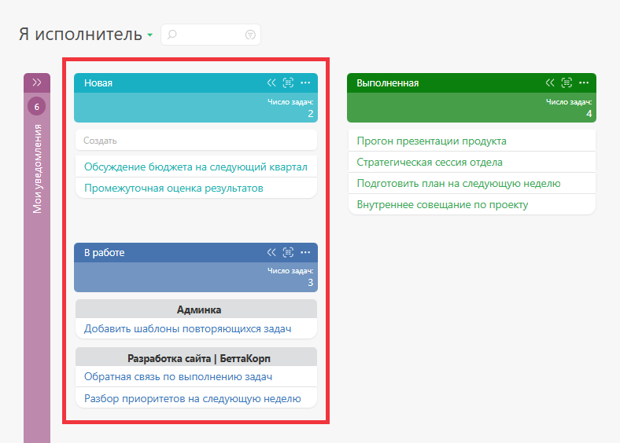

[ Списки в планировщике](Виды_списков_планировщика.md "Виды списков планировщика") можно размещать один под другим и располагать в одном столбце любое разумное их количество: 

  

Цвет заголовка списка можно изменять в его параметрах: 

## Дополнительно:

  * В ходе работы вы также можете использовать [расширенное отображение списков планировщика](Расширенное_отображение_списков_планировщика.md "Расширенное отображение списков планировщика").

  * Вы можете [скрыть поля добавления новых объектов](Скрывать_поле_создания_нового_объекта.md "Скрывать поле создания нового объекта").
