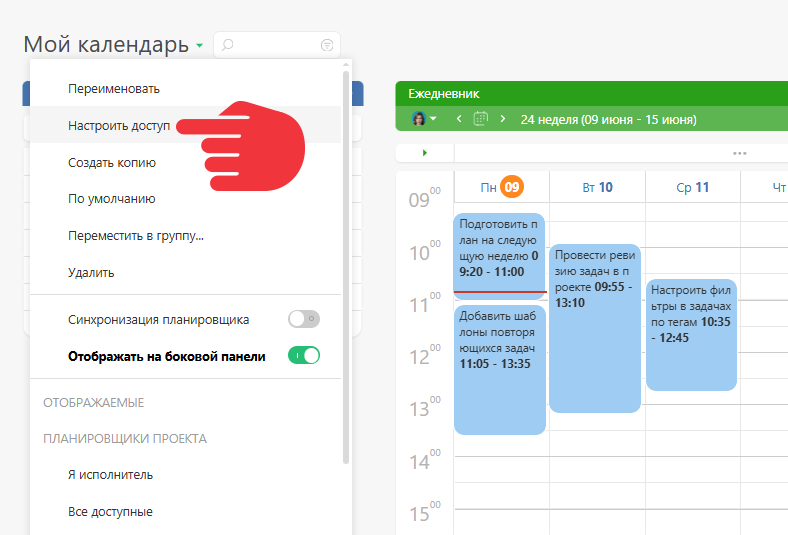
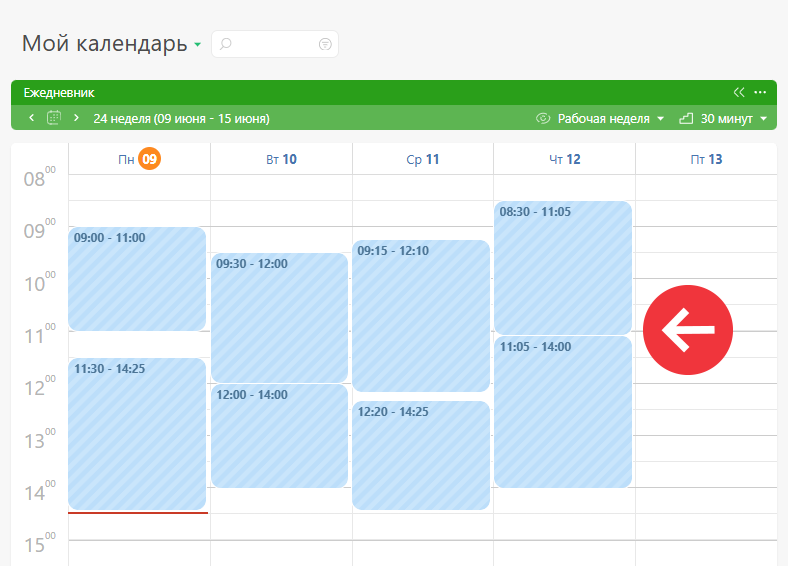

По умолчанию, доступ к [ планировщику](Планировщик.md "Планировщик") имеет только его автор. Вы можете настроить доступ к созданному вами планировщику [ сотрудникам](Сотрудники_и_компания.md "Сотрудники и компания") и [ клиентам](Контакты.md "Контакты"). 

Настройка доступа производится в меню, появляющемся по клику на название планировщика: 

## Важно

  * Наличие у пользователя доступа к планировщику не означает наличие у него доступа ко всем задачам в аккаунте, которые попадают под условия планировщика. Для того, чтобы задача появилась в планировщике, пользователь должен иметь к ней [ доступ](Права_доступа_в_ПланФиксе.md "Права доступа в ПланФиксе"). Следствием этого подхода является то, что в одном и том же планировщике разные пользователи могут видеть разный набор задач.

  * В [ почасовом блоке](Календарь_почасовой.md "Календарь почасовой") планировщика действует специальный механизм, который отображает занятость определенного времени без разглашения информации по задаче, к которой у просматривающего пользователя нет доступа:

