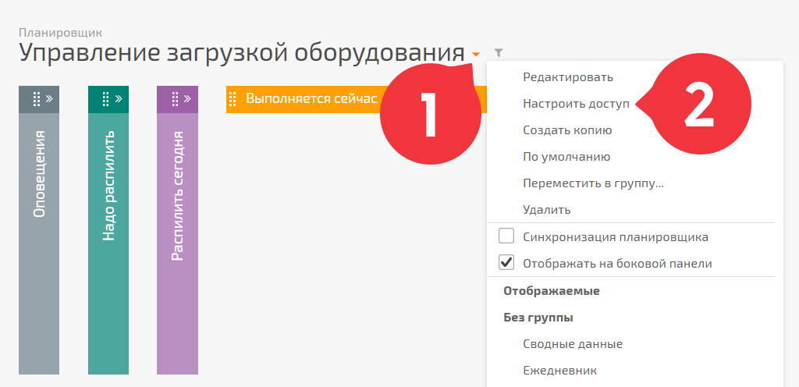
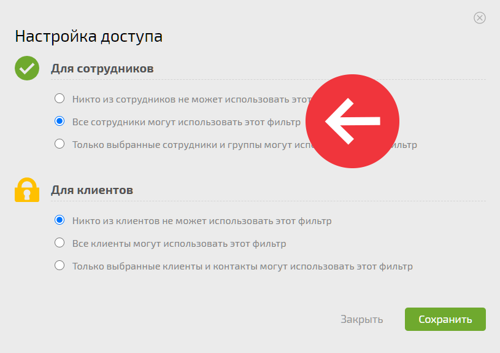

По умолчанию, доступ к [ планировщику](Планировщик.md "Планировщик") есть только у автора. Чтобы сотрудники увидели планировщик настройте к нему доступ. Настройка производится в меню, появляющемся по клику на название планировщика: 

  

  

## Важно

Наличие у пользователя доступа к планировщику не означает наличие у него доступа ко всем задачам в аккаунте, которые попадают под условия планировщика. Для того, чтобы задача появилась в планировщике, пользователь должен иметь к ней [ доступ](Права_доступа_в_ПланФиксе.md "Права доступа в ПланФиксе"). Следствием этого подхода является то, что в одном и том же планировщике разные пользователи могут видеть разный набор задач.
