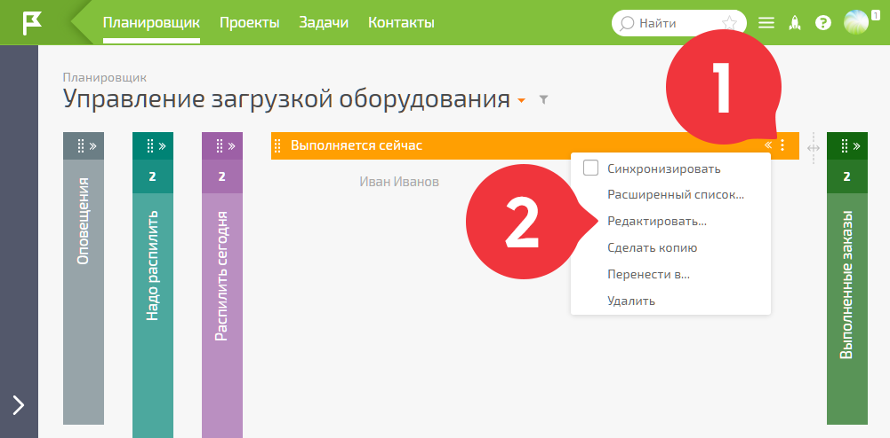
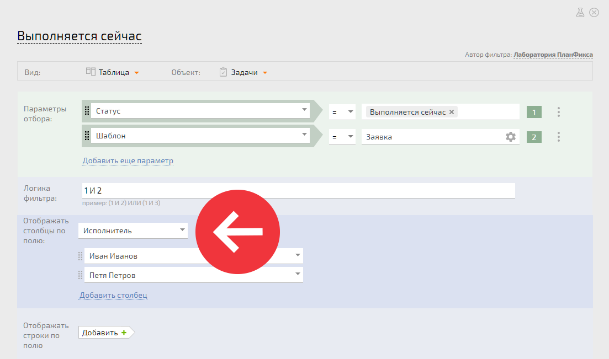
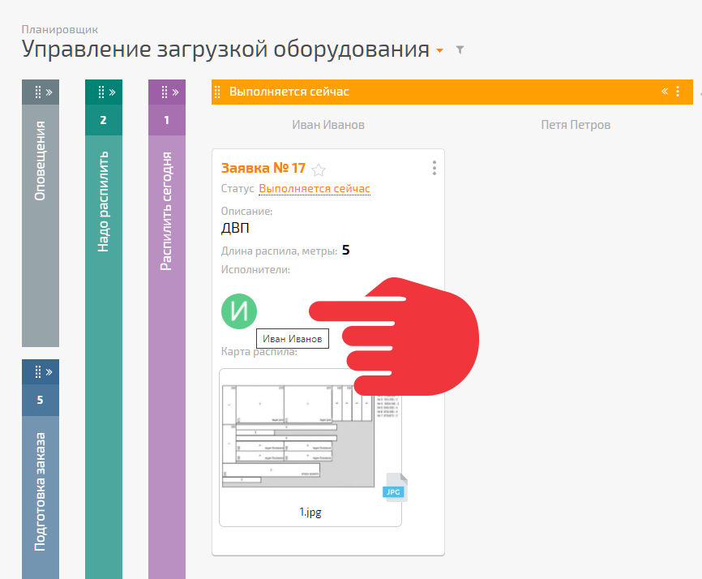

Обычно за каждой единицей оборудования на производстве закреплены ответственные. Их необходимо указать в списке планировщика **Выполняется сейчас**. Это те люди, которые непосредственно на производстве будут выполнять заявку клиента. 

  * Открываете список **Выполняется сейчас** на редактирование:

  

  * Указываете поле **Исполнитель** , по которому будут отображаться столбцы в таблице:

  

  * Теперь при перетаскивании заявки в столбец таблицы исполнителем автоматически станет указанный ответственный:

