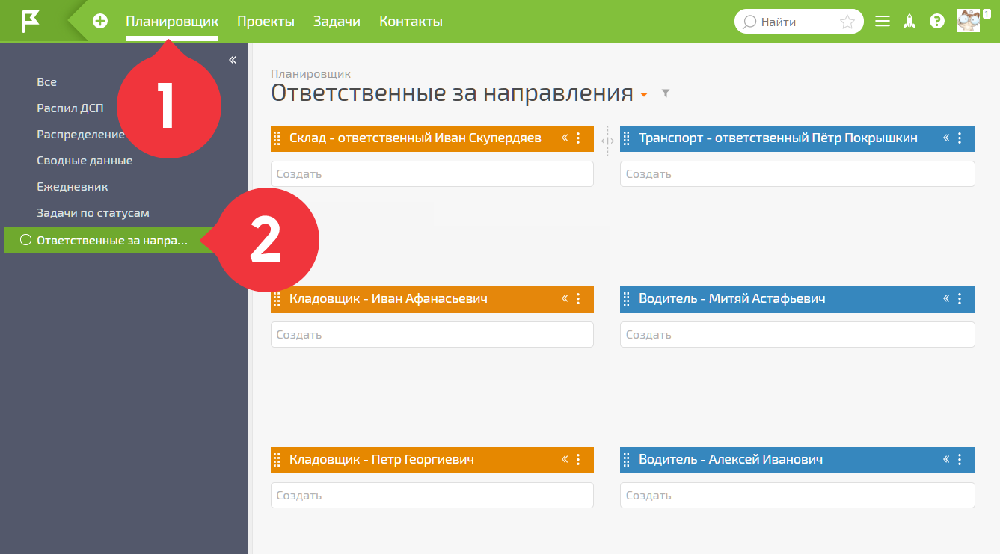

Для установки [мини-конфигурации](Ответственные_за_направления.md "Ответственные за направления") перейдите на страницу [«Ответственные за направления»](https://planfix.ru/conf/partner/160/mini-konfiguracziya-otvetstvennye-za-napravleniya) и нажмите на кнопку **Установить конфигурацию** внизу страницы: 

  

После этого вернитесь в ПланФикс, где автоматически развернётся планировщик, относящийся к организации работы с ответственными за бизнес-направления в компании: 

