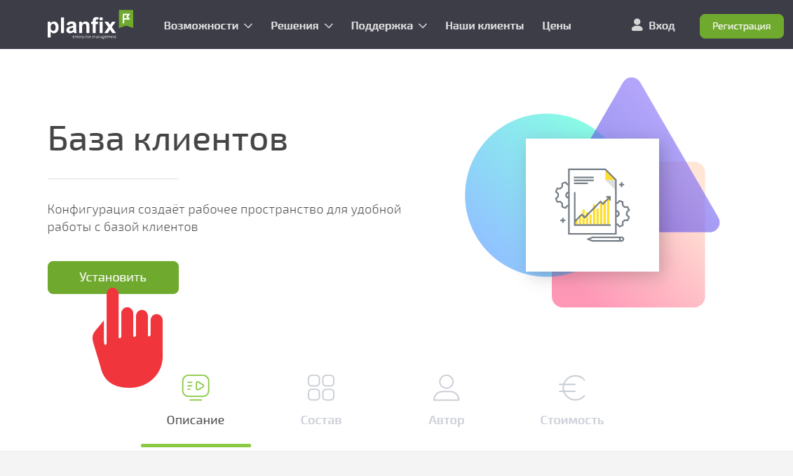
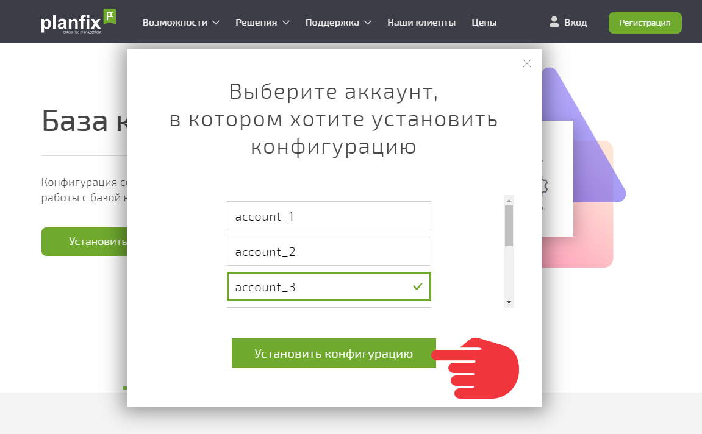

**Пользовательская конфигурация** — это [ конфигурация](Конфигурации.md "Конфигурации"), которую [ создал](Создание_пользовательской_конфигурации.md "Создание пользовательской конфигурации") пользователь ПланФикса. Установить в аккаунт её можно следующим образом: 

  * [Сгенерируйте публичную ссылку](Создание_пользовательской_конфигурации.md "Создание пользовательской конфигурации") для своей конфигурации:

  

  * Авторизуйтесь в аккаунте, в который планируете устанавливать конфигурацию.

  * Откройте полученную ссылку в браузере и нажмите кнопку **Установить** :

  

  * Выберите нужный аккаунт и нажмите кнопку **Установить конфигурацию** :

  

  * Подтвердите установку конфигурации.

  * Когда конфигурация будет установлена, вы увидите её в разделе установленных конфигураций.
