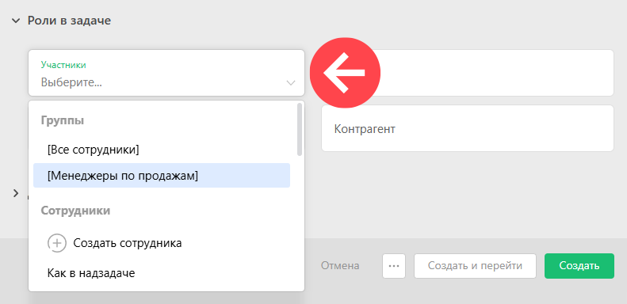
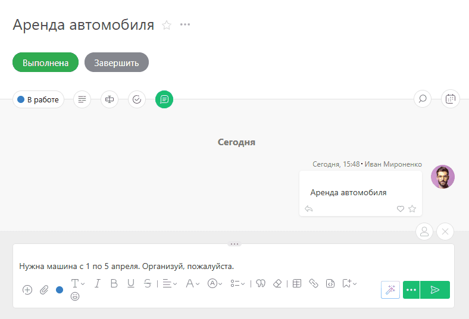
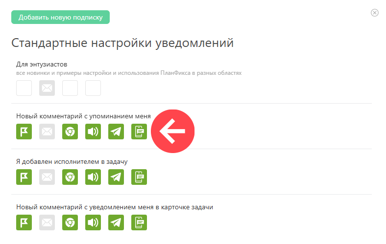

Роль **Участник задачи** служит для того, чтобы дать доступ к задаче пользователю, который не является ее [исполнителем](Исполнители_задачи.md "Исполнители задачи"). Основное отличие этой роли от исполнителя задачи в том, что участник задачи хоть и имеет к ней доступ, но не является ответственным за выполнение этой задачи. Поэтому участник: 

  * не может редактировать или удалять задачу;

  * не может изменять статус задачи;

  * не может передвигать дату завершения задачи;

  * не будет видеть задачу в своем списке **Входящие**.

Но 

  * участник может добавлять и отстранять других участников от задачи.

  

Обычное использование этой роли: доступ к задаче коллег, партнеров или представителей клиента с целью проинформировать о ходе работ или для обсуждения, получения советов и консультаций. Для этой цели участник задачи имеет возможность добавлять в задачу [действия](Действия.md "Действия") и [комментарии](Как_написать_комментарий_к_задаче_.md "Как написать комментарий к задаче?"). 

Другое применение этой роли: делегирование задачи или выполнение задачи цепочкой сотрудников. В этом случае обычно в любой момент времени у задачи есть единственный исполнитель, а остальные пользователи имеют роль участника задачи. В нужный момент текущий исполнитель устанавливает следующего исполнителя, а сам становится участником задачи. 

Как и [исполнители](Исполнители_задачи.md "Исполнители задачи"), участники задачи выбираются из общего списка, в котором присутствует перечень групп, сотрудников и контактов: 

  

Если в качестве участника задачи выбрана **группа сотрудников** , все ее участники будут иметь доступ к задаче. Новые сотрудники, добавленные в эту группу, также получат доступ к такой задаче в качестве участников. 

**Сотрудники аккаунта и клиенты** , которым вы дали доступ в свой аккаунт и подключили к задаче в качестве участников, будут видеть задачу в общих списках доступных им задач. Они могут добавлять к задаче комментарии, файлы и другую информацию с помощью действий. Им также доступен описанный выше функционал добавления действий к задаче с помощью e-mail. 

Быстро подключить сотрудника к задаче или оповестить его о важных изменениях можно с помощью «@» или «+»: 

  

Обратите внимание: 

  * Такой способ упоминания работает только для сотрудников и только в комментариях задач.

  * Если сотрудник ранее не участвовал в задаче, тогда после сохранения комментария с упоминанием ПланФикс подключит его к задаче в качестве участника.

  * В [подписках](Подписки_и_уведомления.md "Подписки и уведомления") можно настроить отдельное правило уведомления на комментарии с таким упоминанием:

    

## Совет

  * Для того, чтобы не добавлять участников к каждой задаче проекта, вы можете добавить их в список [Участники проекта по-умолчанию](Участники_по_умолчанию.md "Участники по умолчанию") в карточке проекта.

## Контакты без доступа в ПланФикс

Если в задаче в одной из ролей (постановщик или [ исполнитель](Исполнители_задачи.md "Исполнители задачи")) участвует **внешний контакт** , не имеющий доступа в ваш аккаунт ПланФикса, он сможет [работать по задаче посредством e-mail](Как_добавить_действие_с_помощью_e-mail_.md "Как добавить действие с помощью e-mail?") или в [ Личном кабинете](Личный_кабинет.md "Личный кабинет"). Его ответы на письма-уведомления от ПланФикса будут добавляться в задачу в качестве действий. Приатаченные к таким письмам файлы будут добавляться к задаче. Таким образом, например, можно организовать работу с внешним фрилансером или клиентом - они будут общаться с помощью привычной почты, а Вы будете видеть всю работу по задаче в ленте действий. 

**Важно:** если при создании или редактировании задачи добавить к ней в роли участника **внешний контакт** , он не получит уведомлений о ней на свой e-mail. Это дает возможность подключать его к задаче для нужд учета (например, отбора по участнику в [ фильтрах](Фильтры_задач.md "Фильтры задач"), [ отчетах](Отчеты.md "Отчеты") или [ Планировщике](Планировщик.md "Планировщик")), не опасаясь, что он получит уведомления о подключении к задаче. При этом если добавить к задаче действие и выбрать такого участника в блоке "Уведомить об этом", он получит письмо с уведомлением о добавленном действии. 

## Дополнительная информация

  * [Комментарии: новый способ уведомления сотрудников](https://planfix.com/ru/blog/kommentarii-novyj-sposob-uvedomleniya-sotrudnikov/)
