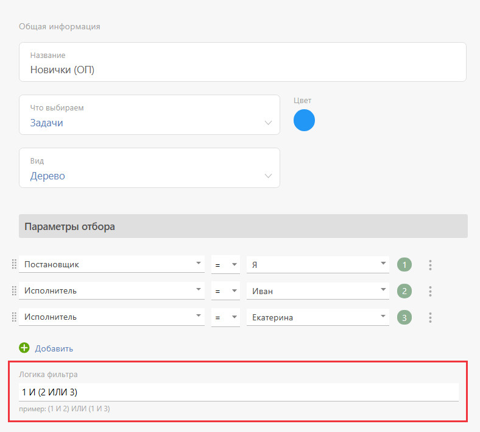
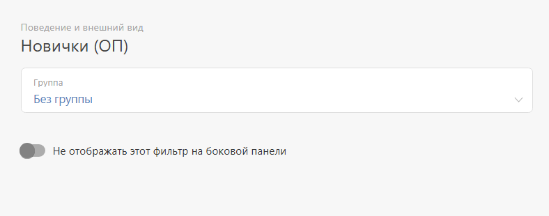
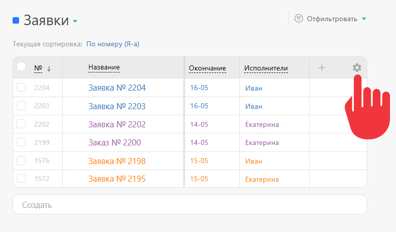
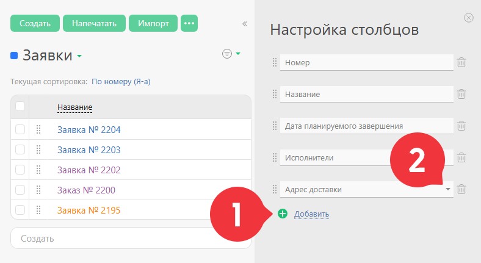
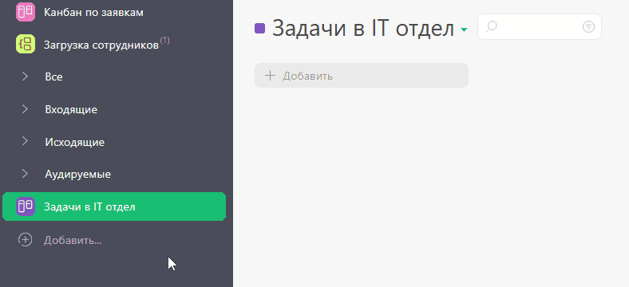

В ПланФиксе реализован гибкий механизм фильтрации [задач](Задачи.md "Задачи") по сложным условиям. Созданными фильтрами можно делиться с другими сотрудниками и клиентами, использовать для [массовых операций над задачами](Массовые_операции_над_задачами.md "Массовые операции над задачами") и для работы в [Планировщике](Планировщик.md "Планировщик"). 

## Создание фильтра

Создать фильтр можно в разделе **Задачи**. Для этого: 

  * На панели слева нажмите кнопку **Добавить**

  * Выберете вид отображения будущего фильтра задач.

  * В появившемся окошке вы можете: 

    * Задать **Название фильтра**

    * Добавить **Параметры отбора** , которым должны соответствовать отфильтрованные задачи. Каждое из условий автоматически нумеруется. Номера условий используются в блоке **Логика фильтра** для задания общего условия отбора задач:

  

**Пример:** фильтр на этом скриншоте приведет к отбору задач, постановщиком которых являюсь я, а исполнителями — Иван или Екатерина. 

В настройках фильтра на панели слева выберите вкладку **Поведение и внешний вид** — здесь можно сразу выбрать место отображения фильтра: 

  * Добавить в **Группу** ;

  * Не отображать / Отобразить на боковой панели **Быстрого доступа** — там, где размещены стандартные фильтры (Все / Входящие / Исходящие и так далее):

  

Функция актуальна, если вы планируете часто пользоваться этим фильтром. 

Готовый фильтр можно: 

  * Использовать разово — кнопка **Отфильтровать**.

  * Сохранить в списке фильтров для последующего использования — кнопка **Отфильтровать и сохранить**.

## Настройка отображения столбцов

ПланФикс позволяет настраивать перечень реквизитов задачи, отображаемых в списке задач. Настройка проводится и запоминается на уровне каждого фильтра. Для настройки кликаем на **Шестеренку** : 

  

Вы можете выводить в списке не только стандартные реквизиты задач, но и значения [ пользовательских полей](Пользовательские_поля_задачи.md "Пользовательские поля задачи"), добавленных вами в систему: 

## Управление фильтрами

Управление фильтром открывается: 

  * Кликом по названию заголовка самого фильтра

либо 

  * На панели слева кликом на пиктограмму с тремя вертикальными точками, которые появляются при наведении курсора мыши на название фильтра.

В управлении фильтром можно: 

  * редактировать текущий фильтр;

  * предоставить к нему доступ нужным сотрудникам или клиентам;

  * создать копию текущего фильтра;

  * установить его по умолчанию (он будет открываться при заходе в раздел Задачи);

  * переместить фильтр в нужную группу фильтров;

  * удалить фильтр;

  * управлять его отображением на панели быстрого доступа;

Изменять порядок отображения фильтров на боковой панели можно простым перетаскиванием: 

## Важно

  * Если в задаче отсутствует [ пользовательское поле](Пользовательские_поля_задачи.md "Пользовательские поля задачи") или оно недоступно сотруднику, который работает с фильтром, условия отбора по такому полю не выполняется.

  * Если вы находитесь в фильтре и создаете задачу в поле быстрого создания или путем нажатия кнопки **Создать** , применяется логика [ автозаполнения реквизитов задачи](Быстрое_создание_задачи_в_списке.md "Быстрое создание задачи в списке") значениями, указанными в параметрах отбора фильтра.

## Полезная информация и ссылки

  * Как пользоваться [ параметрами отбора задач](Параметры_отбора_объектов.md "Параметры отбора объектов") в фильтре.

  * Вы можете использовать отобранные в фильтры задачи для совершения над ними [ массовых операций](Массовые_операции_над_задачами.md "Массовые операции над задачами").

  * Вы можете отладить работу фильтров в [ режиме тестирования](Режим_тестирования_фильтров_задач_и_контактов.md "Режим тестирования фильтров задач и контактов").

  * Также есть возможность создавать [ фильтры шаблонов задач](Фильтры_шаблонов.md "Фильтры шаблонов").
