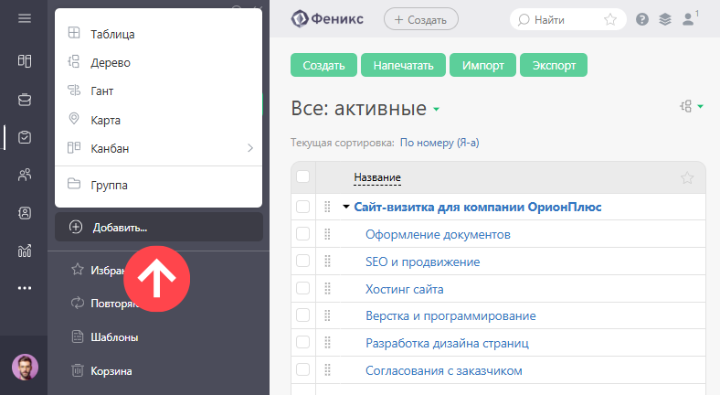
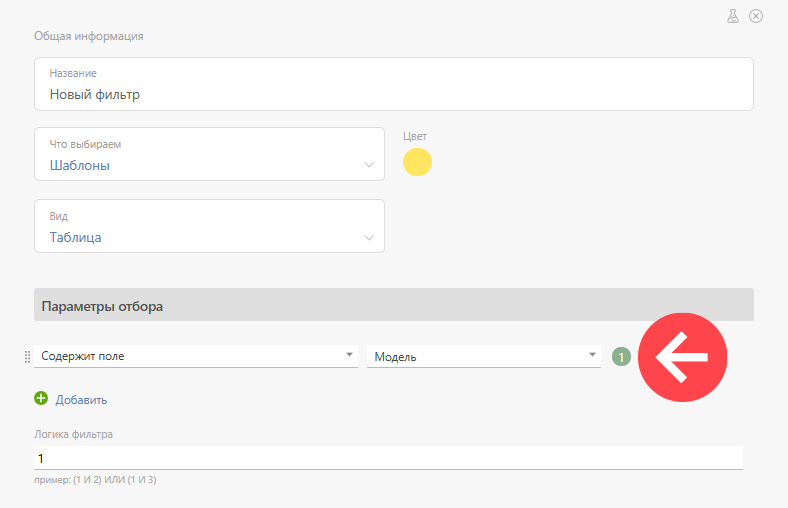

**Фильтры шаблонов задач** повышают удобство работы с [ шаблонами задач](Шаблоны_задач.md "Шаблоны задач") и шаблонами [ повторяющихся задач](Повторяющиеся_задачи.md "Повторяющиеся задачи"). Как и в случае с обычными [ фильтрами задач](Фильтры_задач.md "Фильтры задач"), вы можете задать условия отбора шаблонов в фильтр и разово найти нужные шаблоны или сохранить фильтр для постоянного использования. 

Создается фильтр шаблонов так же, как фильтр задач: 

  * Перейдите в раздел **Задачи**.

  * Нажмите **Добавить** на панели слева.

  * Выберите из списка нужное отображение задач:

  

  * в появившемся окне настройки параметров фильтра выберите объект **Шаблоны** или **Шаблоны повторения** :

  

Дальнейшие настройки и возможности аналогичны настройкам [ фильтра задач](Фильтры_задач.md "Фильтры задач"). 

## Пример

  * Фильтр, который позволяет найти все шаблоны задач, в которых используется поле "Модель":

