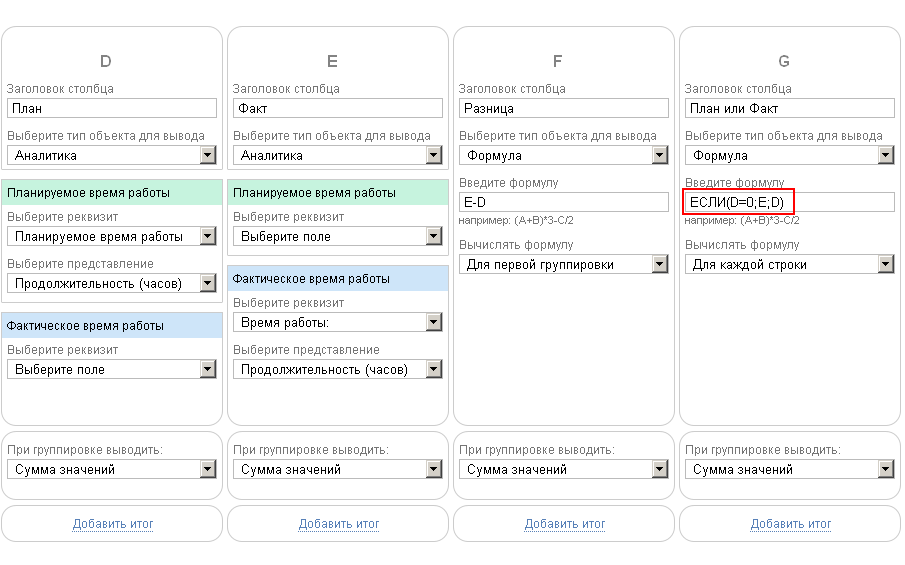

Функция возвращает одно из двух значений, в зависимости от выполнения условия. Формат: 

**ЕСЛИ(условие;значение_да;значение_нет)**

**IF(условие;значение_да;значение_нет)**

где: 

  * **условие** \- логическое выражение с использованием символов >, <, =, >=, <=, !=, другой функции или значения

  * **значение_да** \- числовое или строковое значение , которое вернет функция, если условие выполнится

  * **значение_нет** \- числовое или строковое значение, которое вернет функция, если условие не выполнится

  

**Примеры:**

ЕСЛИ(D="Текст в столбце";"Хорошо";"Плохо") 

ЕСЛИ(D > 100500;"Много";"Мало") 

ЕСЛИ([ СОДЕРЖИТ](Функция_СОДЕРЖИТ.md "Функция СОДЕРЖИТ")(H;"Уточнение");G;"") 

  

**Примечания:**

  * **условие** может быть арифметическим выражением. Если в результате выполнения этого выражения получается какое-то число, отличное от нуля, то считается, что условие выполнено. Если в результате выполнения этого выражения получается ноль, то считается, что условие не выполнено.

  * **значения** , могут представлять собой выражения с использованием данных из столбцов [ отчета](Отчеты.md "Отчеты") или переменных в [ вычисляемых полях](Вычисляемые_поля.md "Вычисляемые поля")

  * Для проверки кастомного поля типа Чекбокс в аналитиках и в вычисляемых полях аналитик используйте проверку "Да"/"Нет". В остальных случаях, вне аналитик, используйте проверку 1/0.

  

## Пример использования

В зависимости от того, содержится ли число в столбце D, выводится либо оно, либо число из столбца E: 

  

## Особенности работы с формулами и функциями

Стоит учесть следующие моменты: 

  * Все аргументы формулы ЕСЛИ должны быть на месте (Условие;Действие_ЕСЛИ_ДА;Действие_ЕСЛИ_НЕТ);

  * Вложенность ЕСЛИ в Действие другие ЕСЛИ не ограничена, но требует соблюдения числа аргументов;

  * Пустые поля типа ЧИСЛО равны нулю и ничему больше;

  * Пустые поля типа СТРОКА и иные (или не все) проверяются через пустые кавычки: "";

  * Умножать на "-1" можно;

  * Формулы не поддерживают переноса строк внутри себя и в документах при генерации.
