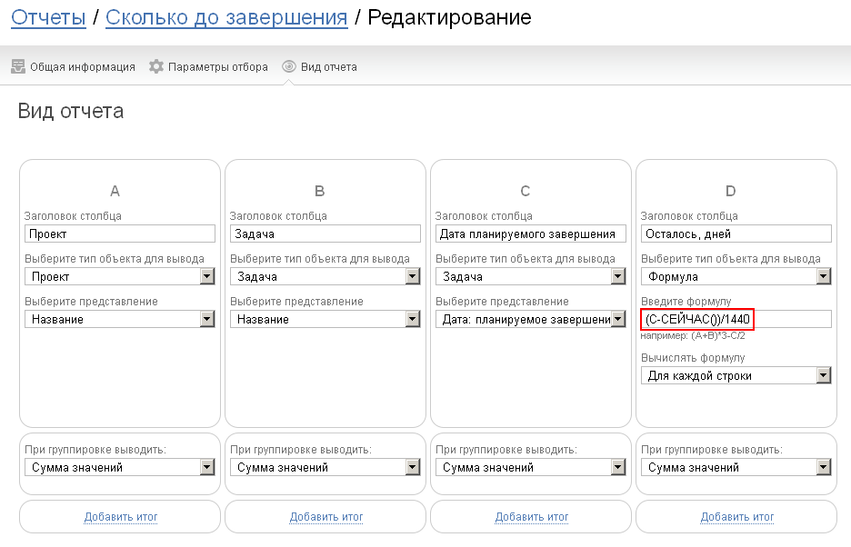

Функция возвращает текущую дату в минутах. Используется для сравнении дат из других полей или столбцов отчета с текущим моментом. Формат: 

**СЕЙЧАС()**

**NOW()**

т.е. функция используется без аргументов в скобках. 

  

## Пример использования

Отчет выводит количество дней, которые остались до момента завершения задачи: 

**Примечание:** разница между датой планируемого завершения задачи (столбец С) и значением, выдаваемым функцией СЕЙЧАС, вычисляется в минутах. Поэтому для отображения результата в днях, полученное значение делится на 1440 (количество минут в дне). 

  

## Важно

Автоматический сценарий при наличии в формуле функции СЕЙЧАС() / NOW() срабатывать не будет.
